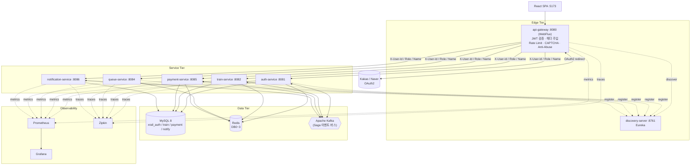
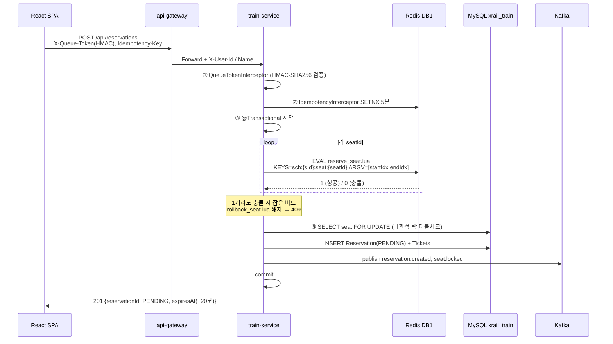
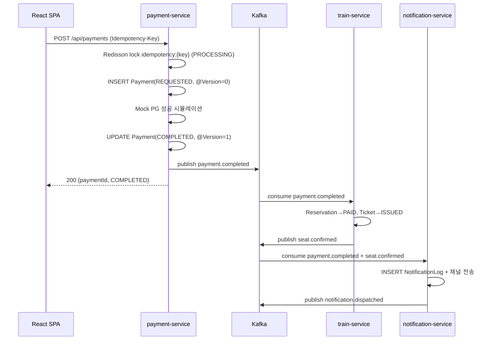
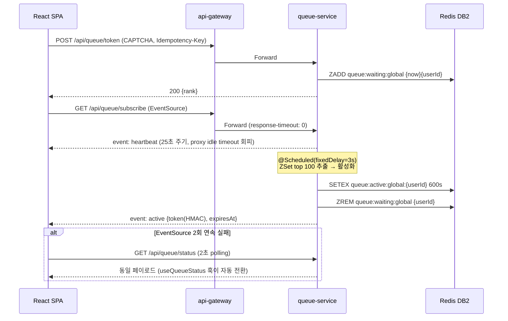
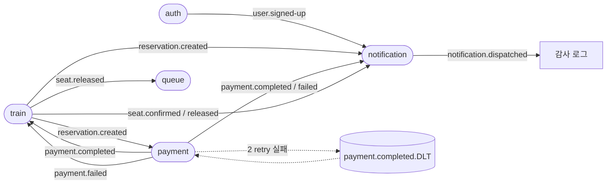
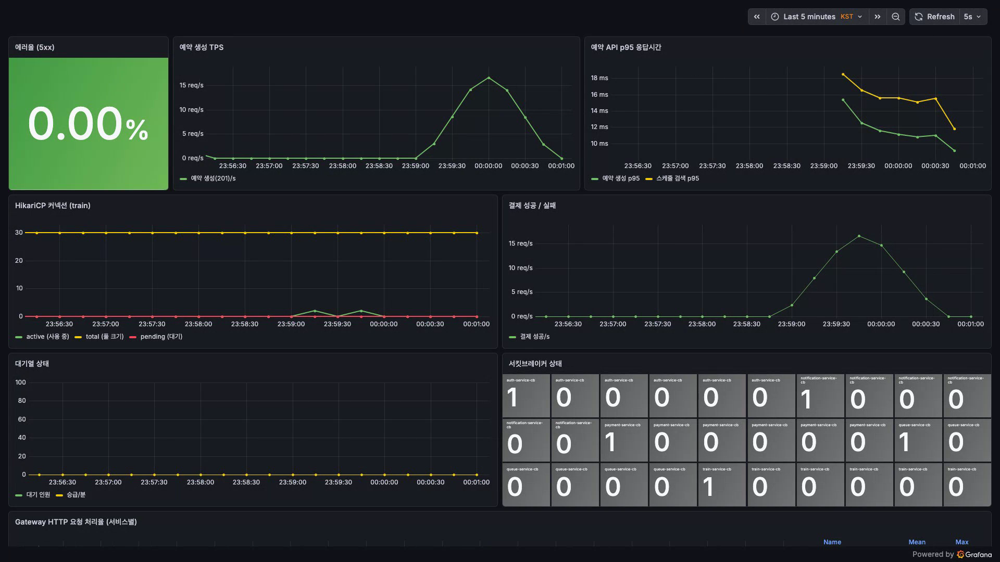
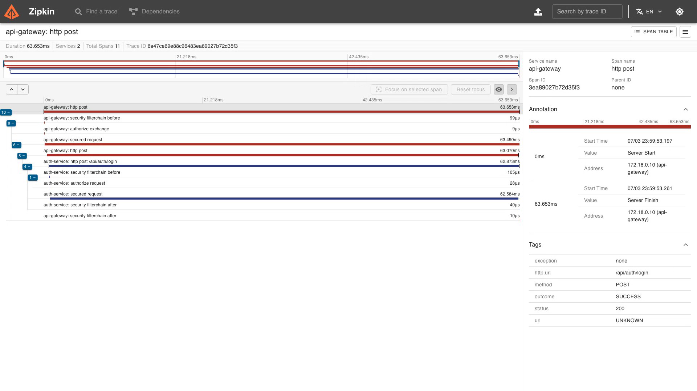

# 🚄 XRail MSA — 고동시성 기차 예매 플랫폼

> Redis Lua 비트마스크 기반 segment 좌석락 · Saga Choreography 분산 트랜잭션 · SSE 대기열을 갖춘 MSA 포트폴리오 프로젝트

**1,000 동시접속 환경에서 좌석 중복 예매 0건**을 목표로, 기차 예매 도메인을 **6개 비즈니스 서비스 + Gateway + Discovery**로 분리하고 이벤트 기반으로 통합한 production-grade 예매 플랫폼입니다.

<!-- ────────────────────────  DEMO  ──────────────────────── -->
> 🎥 **2분 데모 영상**: _(배포 후 링크)_ &nbsp;·&nbsp; 🌐 **라이브 데모**: _(배포 URL 자리표시자)_
> 🧭 **아키텍처 다이어그램**: [`docs/ARCHITECTURE.md`](docs/ARCHITECTURE.md) &nbsp;·&nbsp; 🎬 **촬영 대본**: [`demo/RECORDING.md`](demo/RECORDING.md)

**한 줄 실행** — 전체 스택 + Prometheus/Grafana/Zipkin이 뜨고 헬스체크가 모두 green이 될 때까지 대기:

```bash
./demo-up.sh            # 6서비스 + 관측 스택 한 방 기동 (green까지 폴링)
./demo/seed.sh          # 데모 시드/리셋 (멱등)
./demo/01-oversell.sh   # ① 동시성 · ./demo/02-queue.sh  ② 대기열 · ./demo/03-load.sh  ③ 부하
```

**머니샷 3** &nbsp;— 화면에서 움직이는 핵심 강점:
1. **동시성 증명** — 동일 좌석 100스레드 동시 예매 → 성공 **정확히 1건** / 409 99건 / DB 티켓 1 / **오버부킹 0**
2. **대기열 SSE** — 1,000명 대기 → 3초마다 100명 승급, 순번이 **실시간 감소** → 입장 (AUTO/FORCE_ON 토글)
3. **부하 회복** — 1,000 동접 → Grafana에서 **에러율 0% · 예약 p95 14ms · HikariCP 안정** / Zipkin에 6개 서비스 전 구간 계측
<!-- ──────────────────────────────────────────────────────── -->

---

## 📑 목차

1. [프로젝트 개요](#1-프로젝트-개요)
2. [기술 스택](#2-기술-스택)
3. [시스템 아키텍처](#3-시스템-아키텍처)
4. [데이터 플로우](#4-데이터-플로우)
5. [핵심 기술 포인트 (좌석락·멱등성·매크로 방지)](#5-핵심-기술-포인트)
6. [Troubleshooting](#6-troubleshooting)
7. [부하 테스트](#7-부하-테스트)
8. [로컬 실행 방법](#8-로컬-실행-방법)
9. [디렉터리 구조](#9-디렉터리-구조)
10. [API 요약](#10-api-요약)

---

## 1. 프로젝트 개요

### 1.1 한 줄 소개

고동시성 환경에서 기차 좌석을 **segment(구간) 단위로 안전하게 예매**할 수 있는, 운영·관측 가능한 MSA.

### 1.2 해결하는 문제

| # | 문제 | 해결 전략 |
|---|------|----------|
| 1 | **좌석 중복 예매(Overbooking)** — 동일 좌석·구간을 두 사용자가 동시에 선택 | Redis Lua 비트마스크 atomic 잠금 + DB 비관적 락 더블체크 + 재정합 스케줄러 (3중 안전망) |
| 2 | **트래픽 폭증** — 인기 노선 오픈 시 DB 커넥션 풀 고갈 | Redis Sorted Set 대기열로 게이트 + 3초/100명 단위 입장 |
| 3 | **결제 정합성** — 결제와 좌석 확정이 분산 트랜잭션 | Saga Choreography + 보상 이벤트 + 미결제 자동 만료 |
| 4 | **운영 가시성** — 서비스 6개에 걸친 요청 추적 | Prometheus + Grafana + Zipkin 분산 트레이싱 |

### 1.3 주요 기능

- 회원/비회원 가입·로그인, OAuth2(Kakao/Naver), JWT 회전
- 노선·역·스케줄 마스터 검색, segment 인지 좌석 가용 조회
- Lua 비트마스크 좌석 예매, Idempotency-Key 멱등 처리
- Mock PG 결제, 결제 실패/타임아웃 자동 보상
- SSE 실시간 대기열 + polling fallback
- 관리자 통계·Saga 추적 API
- 풀스택 관측성 + Resilience4j 서킷 브레이커

### 1.4 개발 정보

- **개발자**: 김윤호 (1인 프로젝트)
- **기간**: 2026-05 ~ (M0~M9 완료)
- **규모**: Gradle 멀티모듈 8 백엔드 + React 프론트엔드, 전 모듈 111개 테스트 통과

---

## 2. 기술 스택

### 2.1 Backend

| 영역 | 기술 |
|------|------|
| 언어 / 런타임 | Java 21 |
| 프레임워크 | Spring Boot 3.4.12, Spring Cloud 2024.0.0 |
| API Gateway | Spring Cloud Gateway (Reactive / WebFlux / Netty) |
| Service Discovery | Netflix Eureka |
| ORM / 쿼리 | Spring Data JPA, Hibernate, QueryDSL 5.1 |
| DB 마이그레이션 | Flyway |
| 인증 / 보안 | Spring Security, JJWT 0.12, OAuth2 Client, BCrypt(12 rounds) |
| Rate Limiting | Bucket4j 8.10 + Redis Lua |
| 서킷 브레이커 | Resilience4j (resilience4j-reactor) |

### 2.2 Data / Messaging

| 영역 | 기술 |
|------|------|
| RDB | MySQL 8 (Database per Service — `xrail_auth` / `xrail_train` / `xrail_payment` / `xrail_notify`) |
| Cache / Lock | Redis + Redisson 3.41 (서비스별 logical DB 0~3) |
| Message Broker | Apache Kafka 7.5 (Confluent) + Zookeeper |
| 동시성 제어 | Redis Lua Script (segment 비트마스크), JPA `@Version`, Redisson Lock |

### 2.3 Observability

| 영역 | 기술 |
|------|------|
| 메트릭 | Micrometer + Prometheus |
| 대시보드 | Grafana (5 패널 프로비저닝) |
| 분산 트레이싱 | Brave + Zipkin (HTTP 자동 + Kafka `brave-instrumentation-kafka-clients`) |
| 로깅 | Logback JSON, MDC(`traceId`/`spanId`/`userId`) |

### 2.4 Frontend

| 영역 | 기술 |
|------|------|
| 프레임워크 | React 19 |
| 빌드 | Vite 7 |
| 언어 | TypeScript |
| 라우팅 / HTTP | react-router-dom 7, Axios |
| 실시간 | 브라우저 네이티브 EventSource (SSE) |

### 2.5 Infra / Tooling

| 영역 | 기술 |
|------|------|
| 컨테이너 | Docker, docker-compose (15 컨테이너) |
| 빌드 | Gradle 8.10 (멀티모듈) |
| 부하 테스트 | Apache JMeter |

### 2.6 명시적 미채택 (의사결정)

| 항목 | 사유 |
|------|------|
| WebSocket / STOMP | 단방향 알림은 SSE로 충분, polling fallback이 더 견고 |
| Saga Orchestrator | Choreography로 서비스 의존도 ↓, `reservation_saga_log`로 디버깅 보완 |
| Schema Registry / Avro | 1차는 JSON으로 단순화 |
| Kubernetes | 1차는 docker-compose, K8s는 deferred |
| SpringDoc OpenAPI | 수동 `API.md`로 충분 |

---

## 3. 시스템 아키텍처

### 3.1 서비스 토폴로지



### 3.2 서비스 책임

| 서비스 | 포트 | 책임 | 저장소 |
|--------|------|------|--------|
| **api-gateway** | 8080 | JWT 검증, `X-User-*` 헤더 주입, CORS, Bucket4j Rate Limit, CAPTCHA, SSE 라우팅 | — |
| **discovery-server** | 8761 | Eureka 서비스 레지스트리 | — |
| **auth-service** | 8081 | 회원/비회원 가입·로그인, OAuth2, JWT 발급·회전 | MySQL `xrail_auth`, Redis DB0 |
| **train-service** | 8082 | 스케줄/예약/티켓, **Lua 좌석락**, **보상 Saga 주인** | MySQL `xrail_train`, Redis DB1 |
| **queue-service** | 8084 | Sorted Set 대기열, SSE 알림, 큐 토큰 HMAC | Redis DB2 (Redis-only) |
| **payment-service** | 8085 | Mock PG 결제, Idempotency 버킷, DLT 처리 | MySQL `xrail_payment`, Redis DB3 |
| **notification-service** | 8086 | 도메인 이벤트 → 알림 로그 + 채널 전송 | MySQL `xrail_notify` |

### 3.3 아키텍처 핵심 원칙

- **Database per Service**: 크로스 서비스 FK 금지. 타 서비스 데이터는 `userId(Long)` + 스냅샷 컬럼으로 비정규화.
- **Gateway 단일 인증**: downstream은 Gateway가 주입한 `X-User-Id/Role/Name` 헤더만 신뢰. 자체 JWT 검증 없음. (inbound `X-User-*`는 unconditional strip → 스푸핑 방지)
- **Saga Choreography**: 중앙 오케스트레이터 없음. 보상 책임은 `train-service`에 집중.
- **공통 모듈(`common-lib`)**: `ApiResponse` 응답 envelope, `BusinessException/ErrorCode`, Kafka 이벤트 record(11종), `Topics`/`Headers` 상수 공유.

---

## 4. 데이터 플로우

### 4.1 좌석 예매 (동시성 핵심 — Happy Path)



### 4.2 결제 + 좌석 확정 (Saga Happy Path)



### 4.3 보상(Compensation) 매트릭스

| 시나리오 | 트리거 | 보상 액션 | 발행 이벤트 |
|---------|--------|----------|------------|
| Lua 좌석락 실패 | train-service 동기 | 즉시 부분 rollback + 409 | (이벤트 emit 전) |
| 결제 실패 | `payment.failed` | Redis 비트 해제 + Reservation CANCELLED | `seat.released(PAYMENT_FAILED)` |
| 미결제 타임아웃 (20분) | `ReservationExpiryScheduler`(60s) | Redis 해제 + CANCELLED | `seat.released(TIMEOUT)` |
| 사용자 취소 | `DELETE /api/reservations/{id}` | Redis 해제 + CANCELLED | `seat.released(USER_CANCELLED)` |
| Redis↔DB 정합 깨짐 | `ReconciliationScheduler`(5m) | 고립 비트 해제 | `seat.released(RECONCILE)` |

### 4.4 대기열 흐름 (SSE + Polling Fallback)



### 4.5 Kafka 토픽 토폴로지



| 토픽 | Producer | Consumer | 비고 |
|------|----------|----------|------|
| `user.signed-up` | auth | notification | partitions=1 |
| `reservation.created` | train | payment, notification | partitions=3, key=reservationId |
| `seat.locked` / `seat.confirmed` / `seat.released` | train | notification, queue | |
| `payment.requested` | payment | (감사용) | partitions=1 |
| `payment.completed` | payment | train, notification | partitions=3 |
| `payment.failed` | payment | train, notification | 보상 트리거 |
| `payment.completed.DLT` | (recoverer) | payment | max 2 retry, 1s backoff |
| `notification.dispatched` | notification | — | |

> 모든 이벤트는 `eventId(UUID)`, `occurredAt(ISO-8601)`, `traceId` 포함. 컨슈머는 `eventId` / 상태 가드로 **멱등 처리**.

---

## 5. 핵심 기술 포인트

### 5.1 Lua 비트마스크 segment 좌석락

- 한 노선이 N개 역이면 N-1개 segment. 좌석 점유를 `[startIdx, endIdx-1]` **비트 구간**으로 표현.
- Redis 키 `sch:{scheduleId}:seat:{seatId}`에 Lua 스크립트로 **atomic** 비트 OR/검사 → 서로 겹치지 않는 구간은 같은 좌석도 동시 판매 가능 (예: 서울→대전 + 대전→부산).
- Redisson `RLock`보다 segment 단위로 정밀하며, Lua는 SHA로 캐시되어 모든 인스턴스에서 일관 동작.

### 5.2 3중 안전망

1. **Lua atomic 비트락** — 1차 동시성 차단
2. **DB 비관적 락(`SELECT ... FOR UPDATE`) + `existsOverlap`** — 커밋 시점 더블체크
3. **ReconciliationScheduler(5분)** — Redis 비트 ↔ DB PAID 정합 보정

### 5.3 멱등성 & 분산 트랜잭션 안전장치

- `Idempotency-Key` 인터셉터(Redis SETNX) → 예약/결제 재시도 안전
- Kafka 컨슈머 상태 가드(`status != PENDING` 등) → 중복 이벤트 no-op
- `payment-service`: Redisson lock + JPA `@Version` 낙관락 + DLT

### 5.4 매크로·봇 방지 (Anti-Abuse)

api-gateway의 **5개 `GlobalFilter`** + train-service 인터셉터가 협력하는 다층 방어. 모든 카운터는 **Redis 고정 윈도우** 기반이라 Gateway 수평 확장에도 일관되며, Redis 장애 시 graceful degradation(in-memory fallback / fail-open)으로 가용성을 유지합니다.

| 레이어 | Order | 적용 대상 | 동작 |
|--------|-------|-----------|------|
| **CaptchaStubFilter** | -75 | `/api/auth/signup`, `/api/queue/token` | 시간 기반 토큰 `base64(timestamp_ms)` 검증. `abs(now − ts) ≤ 30s` + Redis `captcha:used:{token}`(TTL 60s)로 **일회성 재사용 차단**. Redis 장애 시 fail-open |
| **BruteForceFilter** | -60 | `/api/auth/login`, `/api/auth/non-member/login` | IP+경로별 1분 내 로그인 실패(401/403) **5회 → 5분 IP 차단**(429 + `Retry-After: 300`). Lua atomic `INCR`+block 스크립트 |
| **BotDetectionFilter** | -55 | 전 경로 (`/actuator/health` 제외) | 봇 User-Agent(`python-requests`, `curl/`, `Go-http-client`, `Scrapy`, `wget/` 등) 또는 **빈 UA → `X-Suspicious: 1` 헤더** 부착 (soft block) |
| **RateLimitFilter** | -50 | 경로별 버킷 | per-IP/min 한도: `login 10` / `signup 5` / `payments 5` / `queue-token 20` / `reservations 30` / `global 100`. **`X-Suspicious` 요청은 한도 절반**. Redis Lua 고정 윈도우 + 인메모리 fallback |
| **QueueTokenInterceptor** | (train-service) | `POST /api/reservations` | 큐 토큰 **HMAC-SHA256 검증**으로 대기열 우회 예매 차단 + 토큰 일회성 추적 |

> 보조: `HeaderStripFilter`(-200) 헤더 스푸핑 차단, `IdempotencyInterceptor` 중복 요청 차단, `SecurityHeaderFilter`(보안 응답 헤더).

**설계 포인트**

- **단계적 강도**: 봇 탐지는 즉시 차단이 아닌 `X-Suspicious` 플래그 → Rate Limit 한도 절반으로 연동해 **false positive 시에도 정상 트래픽을 완전히 막지 않음**.
- **이중 방어**: 로그인은 `BruteForceFilter`(실패 카운터) + `RateLimitFilter`(요청 카운터)가 독립적으로 동작.
- **정직한 한계**: CAPTCHA는 실 프로바이더(reCAPTCHA/hCaptcha) 미연동 **stub**이며, 시간 기반 + 일회성 토큰으로 단순 replay·매크로를 차단하는 수준입니다. 실 연동은 deferred.

---

## 6. Troubleshooting

> 실제 개발 중 발견·수정한 결함을 **문제 → 해결 → 결과** 3단계로 정리했습니다. (전체 목록: `docs/0603.md`)

### 🔴 T-1. 타임존 불일치로 예약 내역이 빈 화면 + 결제 타이머 즉시 만료

- **문제**
  `ReservationResponse`의 `reservedAt`/`expiresAt`를 `LocalDateTime`(시간대 정보 없음)으로 직렬화. 서버는 UTC, 브라우저는 KST(UTC+9)로 파싱 → `new Date("2026-06-02T16:39:02")`가 9시간 앞당겨져 `isExpired()`가 즉시 `true` 반환. 예매 내역이 빈 화면으로 뜨고 결제 페이지 타이머가 00:00으로 시작.
- **해결**
  응답·이벤트 직렬화를 `LocalDateTime` → **`OffsetDateTime(UTC)`** (`.atOffset(ZoneOffset.UTC)`)로 교체. `ReservationResponse`, `PaymentResponse.completedAt`, `TrainEventProducer`의 `expiresAt` 등 시각 직렬화 지점을 모두 일괄 수정.
- **결과**
  브라우저가 오프셋을 포함해 정확히 파싱 → 예매 내역 정상 표시, 결제 타이머 20분 정상 카운트다운. 알림 payload의 만료 시각 9시간 오차도 동시 해소.

### 🔴 T-2. 중복 `payment.failed` 수신 시 다른 예약의 좌석 비트를 오해제 (더블부킹)

- **문제**
  `handlePaymentCompleted`는 PAID 가드로 멱등했지만 `handlePaymentFailed`에는 가드가 없었음. 중복 `payment.failed` 이벤트 수신 시 `rollback_seat.lua`가 재실행되는데, **비트마스크에는 소유권 정보가 없어** 그 사이 같은 좌석을 점유한 *다른 예약*의 비트까지 해제 → 더블부킹으로 이어지는 실제 동시성 버그.
- **해결**
  컨슈머 진입부에 `if (reservation.status != PENDING) return;` 멱등 가드 추가. 중복 수신과 `payment.completed` 선행 도착 모두에 대해 순서 안전성 확보.
- **결과**
  중복/순서 역전 이벤트가 와도 보상 로직이 한 번만 실행 → 타 예약 비트 오해제 차단. Kafka 멱등 컨슈머 규칙(P4) 준수.

### 🔴 T-3. 만료 스케줄러가 detached 엔티티를 수정 → 매 60초 무한 보상 루프

- **문제**
  `ReservationExpiryScheduler`가 트랜잭션 밖에서 조회한 **detached 엔티티**를 `@Transactional expireReservation()`에 그대로 전달. detached 상태라 `reservation.cancel()`이 dirty-checking으로 flush되지 않아 `status`가 PENDING으로 남음 → 다음 쿼리에 또 잡혀 **매 60초마다 rollback + `seat.released` 무한 반복**. 조회~처리 사이 PAID로 바뀐 예약을 취소하는 race도 존재.
- **해결**
  트랜잭션 **내부에서 `findById`로 managed 엔티티 재조회** 후 변경. 진입부에 `status != PENDING` 가드를 추가해 DB를 source of truth로 삼음.
- **결과**
  만료 처리가 1회만 수행되고 PAID 예약은 건너뜀 → 무한 `seat.released` 이벤트와 알림 노이즈 제거.

### 🟠 T-4. UNIQUE 제약 위반 catch가 트랜잭션 전체를 rollback-only로 마킹 → DLT 적재

- **문제**
  `notification-service`가 단일 `@Transactional` 안에서 `NotificationLog`를 저장. 중복 이벤트로 `UNIQUE(correlation_id)` 위반이 나면 Hibernate가 트랜잭션을 **rollback-only**로 마킹 → catch해도 커밋 시점에 `UnexpectedRollbackException` → Kafka 재시도 후 DLT 적재. 멱등 처리(N1) 규칙이 실제 DB에서 깨졌고, Mockito mock 기반 단위 테스트라 미검출.
- **해결**
  `NotificationLogWriter`를 분리해 채널별 INSERT를 **`@Transactional(REQUIRES_NEW)`** 독립 트랜잭션으로 격리. UNIQUE 위반이 해당 채널 트랜잭션만 롤백하고 상위 흐름은 정상 커밋.
- **결과**
  중복 이벤트가 정상적으로 멱등 무시되고 DLT 오적재 제거. 실제 DB 통합 테스트로 회귀 검증.

### 🟠 T-5. Reconciliation이 in-flight 예약의 비트를 phantom으로 오삭제

- **문제**
  `create()`가 Lua 비트를 set한 뒤 **트랜잭션 커밋 전(티켓 미가시)** 에 `ReconciliationScheduler`가 돌면, DB에서 티켓을 못 찾아 phantom으로 오인 → 비트 제거 + 허위 `seat.released` 발행. 서브초 윈도우의 더블부킹 가능성과 알림 노이즈.
- **해결**
  **연속 2회 reconcile 모두 phantom**일 때만 제거(`previousPhantomCandidates` 비교). in-flight 예약은 다음 사이클에 커밋되어 후보에서 제외됨.
- **결과**
  정상 예약의 비트 오삭제 제거. 진짜 고립 비트만 정리.

### 🔵 T-6. Docker 인프라 기동 실패 (healthcheck + Eureka zone)

- **문제**
  ① `discovery-server` healthcheck가 `curl -f` 사용 → Alpine JRE에 `curl` 미설치로 healthcheck 실패 → downstream 서비스 전체 기동 불가.
  ② `.env`의 `EUREKA_DEFAULT_ZONE`이 `http://localhost:8761/...` → 컨테이너 내부에서 자기 자신을 가리켜 모든 서비스의 Eureka 등록 실패 → Gateway `lb://` resolve 불가로 전 API 503.
- **해결**
  ① healthcheck를 `wget -qO-`로 교체. ② `EUREKA_DEFAULT_ZONE`을 컨테이너 네트워크 호스트명 `http://discovery-server:8761/eureka/`로 수정.
- **결과**
  전체 15개 컨테이너 정상 healthy, 6개 서비스 Eureka 등록 및 Gateway 라우팅(OAuth 포함) 복구.

---

## 7. 부하 테스트

> Apache JMeter 1,000 동시접속 시나리오. 플랜: `docs/jmeter/xrail-load-test.jmx`

### 7.1 목표 지표

| 지표 | 목표 |
|------|------|
| 좌석 중복 예매(overbooking) | **0건** |
| API p95 latency (예매 시점) | < 800ms |
| API p50 latency (조회) | < 100ms |
| error rate | < 1% |
| 좌석 락 atomic 성공률 | 100% (100 스레드 동일 좌석 경합) |

### 7.2 테스트 시나리오

**시나리오 A — End-to-End 예매 플로우 (1,000 user)**
```
1. 로그인         POST /api/auth/login
2. 스케줄 검색     GET  /api/schedules?departureStationId&arrivalStationId&date
3. 좌석 조회       GET  /api/schedules/{id}/seats
4. 대기열 진입     POST /api/queue/token → SSE/polling 활성화 토큰 획득
5. 좌석 예매       POST /api/reservations  (X-Queue-Token, Idempotency-Key)
6. 결제           POST /api/payments
   → ramp-up: 60s, loop: 1, p95 < 800ms / error < 1% 검증
```

**시나리오 B — 동일 좌석 동시 경합 (100 thread)**
```
100개 스레드가 동일 schedule + 동일 seat + 동일 segment를 동시에 POST /api/reservations
   → 기대: 정확히 1건 201, 나머지 99건 409(SEAT_ALREADY_TAKEN)
   → overbooking = 0 검증 (3중 안전망 동작 확인)
```

**시나리오 C — 보상 경로 부하 (결제 실패/타임아웃)**
```
PAYMENT_MOCK_FAIL=true 환경에서 예매→결제 → payment.failed 보상 흐름
   → seat.released(PAYMENT_FAILED) 발행 및 Redis 비트 해제율 검증
```

### 7.3 테스트 결과

> ⏳ *부하 테스트 실행 후 작성 예정 — 현재 공란*

| 시나리오 | 동시 사용자 | p50 | p95 | p99 | error rate | overbooking |
|---------|-----------|-----|-----|-----|-----------|-------------|
| A. E2E 예매 | 1,000 | _TBD_ | _TBD_ | _TBD_ | _TBD_ | _TBD_ |
| B. 동일 좌석 경합 | 100 | _TBD_ | _TBD_ | _TBD_ | _TBD_ | _TBD_ |
| C. 보상 경로 | — | _TBD_ | _TBD_ | _TBD_ | _TBD_ | _TBD_ |

**Grafana 대시보드 / JMeter Summary Report 스크린샷**

> ⏳ *측정 후 이미지 첨부 예정*
>
> <!--  -->
> <!--  -->
> <!--  -->

---

## 8. 로컬 실행 방법

### 8.1 사전 요구사항

- Docker / docker-compose
- JDK 21
- Node.js 20+ (frontend)
- 권장 메모리: 16GB+ (15 컨테이너)

### 8.2 실행

```bash
# 1. 환경변수 준비
cp .env.example .env
# .env 편집: JWT_SECRET(64자+), QUEUE_HMAC_SECRET(32자+),
#           AUTH/TRAIN/PAYMENT/NOTIFY_DB_PASSWORD, (선택) KAKAO/NAVER OAuth

# 2. 인프라 기동 (MySQL, Redis, Kafka, Prometheus, Grafana, Zipkin)
docker-compose up -d mysql redis zookeeper kafka prometheus grafana zipkin

# 3. Discovery → 비즈니스 서비스 → Gateway 순서로 기동
./gradlew :discovery-server:bootRun
./gradlew :auth-service:bootRun
./gradlew :train-service:bootRun
./gradlew :queue-service:bootRun
./gradlew :payment-service:bootRun
./gradlew :notification-service:bootRun
./gradlew :api-gateway:bootRun

# 4. Frontend
cd frontend && npm install && npm run dev   # http://localhost:5173

# (또는) 전체 docker-compose 기동
docker-compose up -d
```

### 8.3 동작 확인

```bash
curl http://localhost:8761            # Eureka 대시보드
curl http://localhost:8080/actuator/health   # Gateway health

# 회원가입 → 로그인 스모크 테스트
curl -X POST localhost:8080/api/auth/signup \
  -H 'Content-Type: application/json' \
  -d '{"loginId":"test","password":"Test1234!","name":"테스터","email":"test@test.com","phone":"01012345678","birthDate":"19900101"}'
```

### 8.4 주요 엔드포인트

| 용도 | URL |
|------|-----|
| Frontend SPA | http://localhost:5173 |
| API Gateway | http://localhost:8080 |
| Eureka | http://localhost:8761 |
| Prometheus | http://localhost:9090 |
| Grafana | http://localhost:3000 |
| Zipkin | http://localhost:9411 |

---

## 9. 디렉터리 구조

```
xrail-msa/
├── settings.gradle / build.gradle      # Gradle 멀티모듈 루트
├── docker-compose.yml                  # 15 컨테이너
├── .env.example                        # 환경변수 템플릿
├── docker/
│   ├── mysql/init/                     # 스키마·유저 생성 스크립트
│   ├── prometheus.yml
│   └── grafana/provisioning/           # 대시보드 5패널 + datasource
├── docs/
│   ├── PRD.md / ARCHITECTURE.md        # 요구사항·아키텍처
│   ├── ERD.md / API.md                 # 스키마·API 계약
│   ├── 0602.md / 0603.md               # 세션 로그·버그 트래킹
│   └── jmeter/xrail-load-test.jmx      # 부하 테스트 플랜
├── common-lib/                         # ApiResponse, BusinessException,
│                                       #   Kafka 이벤트 record, Topics/Headers
├── discovery-server/                   # Eureka
├── api-gateway/                        # JWT 검증, Rate Limit, CAPTCHA, 보안 필터
├── auth-service/                       # 인증·OAuth2·JWT
├── train-service/                      # 예약·Lua 좌석락·보상 Saga (코어)
├── queue-service/                      # 대기열·SSE
├── payment-service/                    # 결제·Idempotency·DLT
├── notification-service/               # 알림
└── frontend/                           # React 19 + Vite + TS (9 페이지)
```

---

## 10. API 요약

> 전체 계약은 `docs/API.md` 참조. 모든 응답은 `ApiResponse<T>` envelope.

| 메서드 | 경로 | 설명 | 인증 |
|--------|------|------|------|
| POST | `/api/auth/signup` | 회원가입 | public |
| POST | `/api/auth/login` | 로그인 (access 30m + refresh 14d) | public |
| POST | `/api/auth/refresh` | 토큰 회전 | public |
| POST | `/api/auth/guest/register` | 비회원 가입 (accessCode 발급) | public |
| GET | `/oauth2/authorization/{kakao\|naver}` | OAuth2 진입 | public |
| GET | `/api/stations` | 역 목록 | required |
| GET | `/api/schedules` | 스케줄 검색 | required |
| GET | `/api/schedules/{id}/seats` | segment 인지 좌석 가용 | required |
| POST | `/api/reservations` | 좌석 예매 (Queue-Token + Idempotency-Key) | required |
| GET | `/api/reservations` | 내 예매 내역 | required |
| DELETE | `/api/reservations/{id}` | 예매 취소 | required |
| POST | `/api/payments` | 결제 (Idempotency-Key) | required |
| POST | `/api/queue/token` | 대기열 진입 | required |
| GET | `/api/queue/subscribe` | SSE 대기열 구독 | required |
| GET | `/api/queue/status` | polling fallback | required |
| GET | `/api/admin/stats` | 예약 통계 | ROLE_ADMIN |

---

## 📌 마일스톤 진행 현황

| 단계 | 내용 | 상태 |
|------|------|------|
| M0 | 부트스트랩 (Gradle 멀티모듈, docker-compose) | ✅ |
| M1 | common-lib + auth-service (JWT/OAuth2) | ✅ |
| M2 | api-gateway (JWT 검증, Rate Limit, 보안 필터) | ✅ |
| M3 | train-service (Lua 좌석락, Saga) | ✅ |
| M4 | queue-service (SSE + polling) | ✅ |
| M5 | payment-service (Mock PG, DLT) | ✅ |
| M6 | notification-service | ✅ |
| M7 | 관측성 + Resilience4j | ✅ |
| M8 | Frontend (React SPA) | ✅ |
| M9 | JMeter 부하 테스트 플랜 | ✅ (실측 진행 예정) |

---

**개발자**: 김윤호 · rladbsgh27@gmail.com
</content>
</invoke>
