# XRail MSA — System Architecture

> 이 문서는 XRail + ticketing-system을 통합한 신규 기차 예매 플랫폼의 시스템 아키텍처를 정의한다. PRD/ERD/API 문서의 베이스이다.

## 0. 한눈에 보는 요약

- **제품 정체성**: 고동시성 기차 예매 단일 제품. 콘서트 도메인 폐기.
- **아키텍처 패턴**: Spring Cloud Gateway + Eureka 기반 MSA. 6개 비즈니스 서비스 + 1개 디스커버리 + 1개 게이트웨이.
- **분산 트랜잭션**: Saga Choreography (Kafka 이벤트 연쇄). 보상 주인은 train-service.
- **동시성 핵심**: Redis Lua 비트마스크(segment 단위) + DB 더블체크 + 재정합화 스케줄러. payment-service는 JPA `@Version` + Redisson idempotency 버킷.
- **인증**: Gateway에서 JWT 검증 → `X-User-Id/Role/Name` 헤더로 downstream 전달. OAuth2(Kakao/Naver) + Guest(NonMember) + Bucket4j 레이트리미트.
- **대기열**: Redis Sorted Set + 3초/100명 스케줄러 + CAPTCHA + Idempotency-Key. **SSE + polling fallback** (WebSocket 폐기).
- **관측성**: Prometheus + Grafana + Zipkin + Resilience4j + Micrometer.
- **데이터 격리**: Database per service (단일 MySQL 인스턴스 + 서비스별 스키마). 크로스 서비스 FK 없음.

---

## 1. C4 — System Context

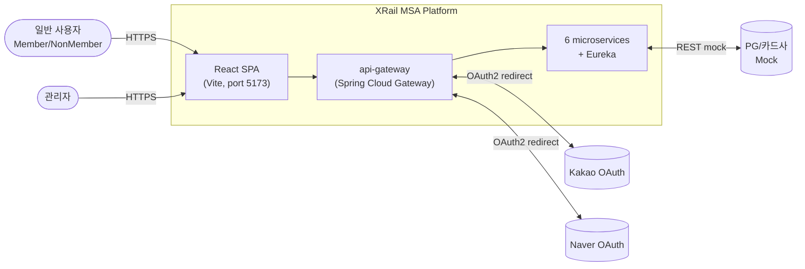

**외부 의존성**
- 카카오/네이버 OAuth2 — 소셜 로그인. redirect URI는 Gateway 경로.
- PG/카드사 — 결제. 1차에는 mock(`payment.mock.always-fail=false|true` 토글).
- 알림 채널(SMS/Email) — `notification-service`가 채널 어댑터 보유. 1차에는 stub.

---

## 2. C4 — Container (서비스 토폴로지)

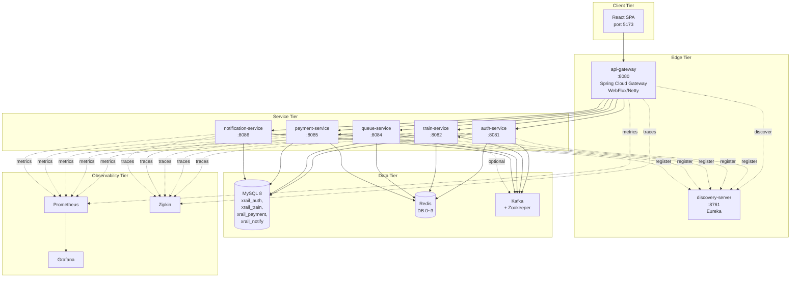

### 2.1 컨테이너 상세

| 컨테이너 | 포트 | 스택 | 책임 | 상태 저장소 |
|---------|------|------|------|------------|
| **react-spa** | 5173 | React 19 + Vite + TS | UI, EventSource 큐 구독, polling fallback, OAuth2 redirect 수신 | — |
| **api-gateway** | 8080 | Spring Cloud Gateway (reactive) | JWT 검증 GlobalFilter, 헤더 주입, CORS, Bucket4j 레이트리미트, CAPTCHA 검증, OAuth2 진입점, SSE 라우팅 | — |
| **discovery-server** | 8761 | Eureka Server | 서비스 레지스트리 | — |
| **auth-service** | 8081 | Spring MVC + JPA + Security | 회원/비회원 가입·로그인, OAuth2(Kakao/Naver), JWT 발급, refresh 토큰 회전 | MySQL `xrail_auth`, Redis DB 0 |
| **train-service** | 8082 | Spring MVC + JPA + QueryDSL + Redisson + Kafka | 스테이션/노선/스케줄/예약/티켓, Lua 비트마스크 좌석락, 보상 saga 주인 | MySQL `xrail_train`, Redis DB 1 |
| **queue-service** | 8084 | Spring MVC + Redisson + Kafka | Sorted Set 대기열, 3초/100명 스케줄러, SSE 알림, CAPTCHA, 큐 토큰 HMAC | Redis DB 2 (Redis-only) |
| **payment-service** | 8085 | Spring MVC + JPA + Kafka + Redisson | 결제 요청·확정·실패, idempotency 버킷, DLT 처리 | MySQL `xrail_payment`, Redis DB 3 |
| **notification-service** | 8086 | Spring MVC + JPA + Kafka | 도메인 이벤트 → 알림 로그 + 채널 전송 | MySQL `xrail_notify` |
| **mysql** | 3306 | MySQL 8 | 4개 스키마 격리 | — |
| **redis** | 6379 | Redis | 서비스별 logical DB index | — |
| **kafka + zookeeper** | 9092/2181 | Confluent 7.5 | 이벤트 버스 | — |
| **prometheus** | 9090 | Prometheus | 각 서비스 `/actuator/prometheus` 스크랩 | — |
| **grafana** | 3000 | Grafana | 대시보드 | — |
| **zipkin** | 9411 | Zipkin | 분산 트레이싱 | — |

---

## 3. C4 — Component (train-service 내부 예시)

train-service는 가장 복잡한 서비스이므로 컴포넌트 단위 도식화.

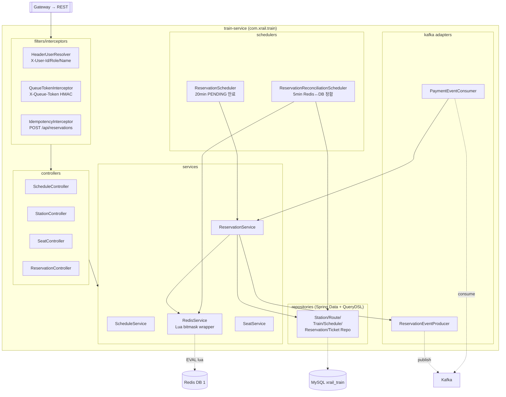

**핵심 컴포넌트 요약**
- `ReservationService.createReservation` — 1 트랜잭션에 ① Lua 비트마스크 좌석 잠금 → ② DB 더블체크(`existsOverlap`) → ③ Reservation/Ticket 저장 → ④ `reservation.created` + `seat.locked` emit.
- `RedisService` — Lua 스크립트 `reserve_seat.lua` / `rollback_seat.lua` wrapper. 키 `sch:{scheduleId}:seat:{seatId}`. Segment 비트마스크 인덱스는 `startStationIdx ~ endStationIdx-1`.
- `PaymentEventConsumer` — `payment.completed` 수신 시 Reservation PAID 갱신 + `seat.confirmed` emit. `payment.failed` 수신 시 `RedisService.releaseSeat` + Reservation CANCELLED + `seat.released(PAYMENT_FAILED)` emit.
- `ReservationScheduler`(60초 주기) — PENDING > 20분 → CANCELLED + Lua rollback + `seat.released(TIMEOUT)` emit.
- `ReservationReconciliationScheduler`(5분 주기) — Redis 비트마스크 vs DB PAID 정합 점검. 고립 잠금 정리 시 `seat.released(RECONCILE)` emit.

---

## 4. 인증 흐름

### 4.1 회원 로그인 (자격증명)

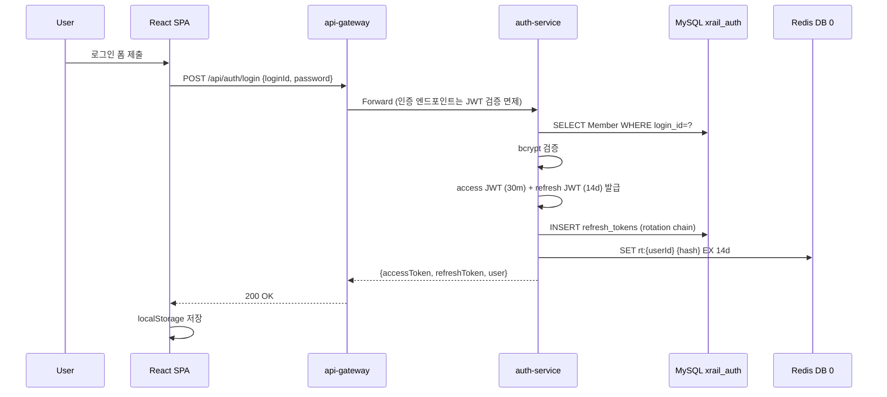

### 4.2 JWT 검증된 일반 요청

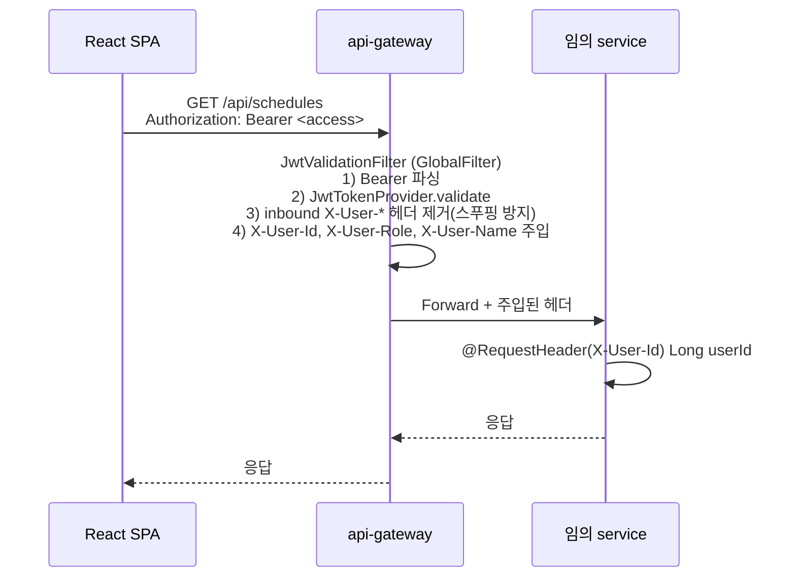

### 4.3 OAuth2 (Kakao 예시)

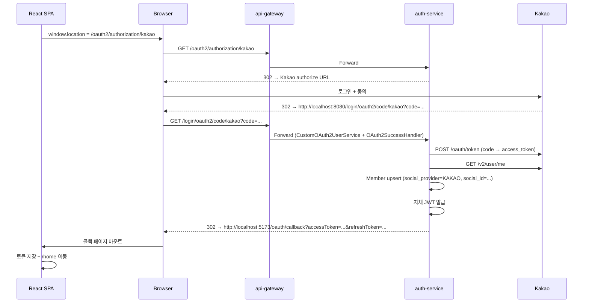

### 4.4 Guest (NonMember) 흐름

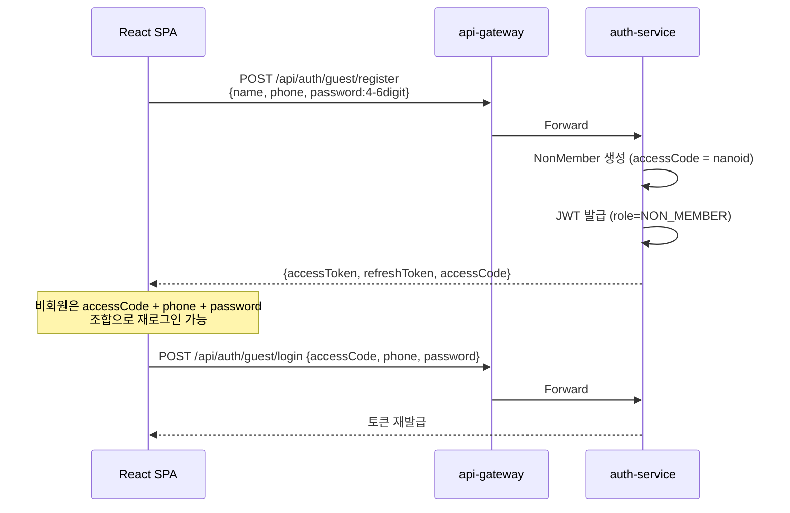

---

## 5. 대기열 흐름 (SSE + Polling Fallback)

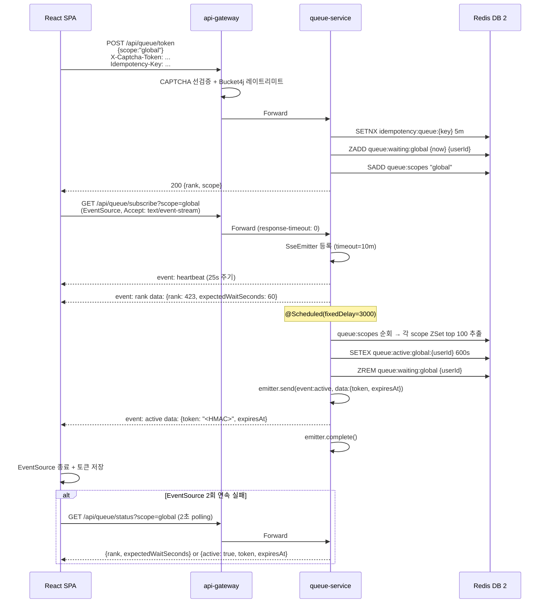

**핵심 포인트**
- 큐 토큰(X-Queue-Token) = `HMAC_SHA256(userId:scope:exp, secret)`. train-service의 `QueueTokenInterceptor`가 `POST /api/reservations`에서 검증.
- SSE heartbeat 25초로 proxy idle timeout(보통 60초) 회피.
- Polling fallback의 응답 JSON은 SSE `event: rank` 페이로드와 동일 형식 → SPA 훅(`useQueueStatus`) 하나로 양 경로 지원.
- `scope`는 1차에 `"global"` 고정. 차후 `"schedule:{id}"`로 트래픽 분산 가능.

---

## 6. 좌석 예약 — 동시성 핵심

### 6.1 happy path

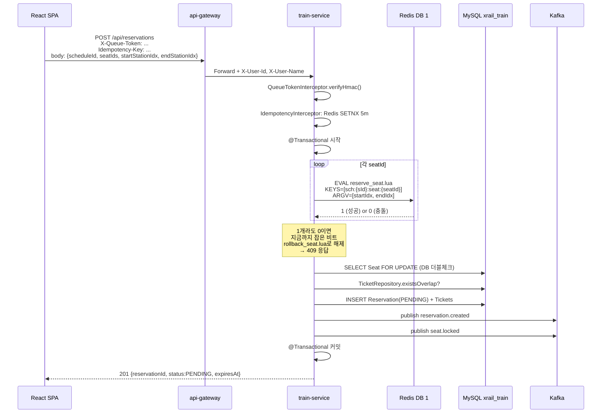

### 6.2 결제 + 좌석 확정 (Saga happy path)

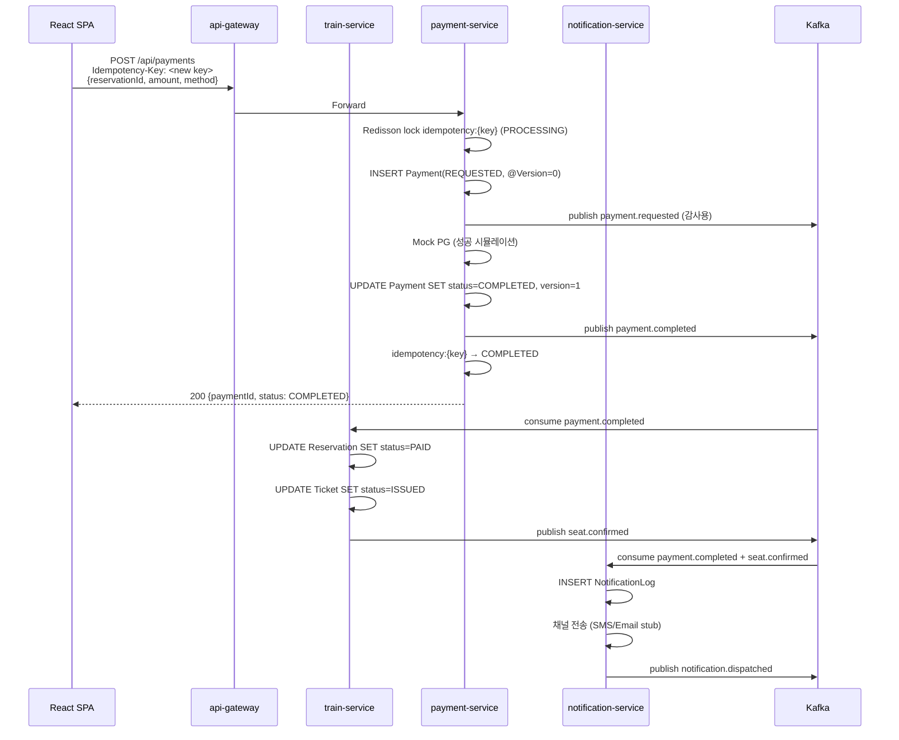

### 6.3 결제 실패 보상

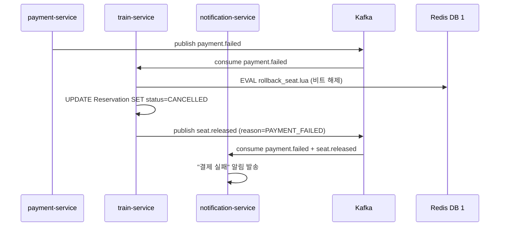

### 6.4 미결제 타임아웃

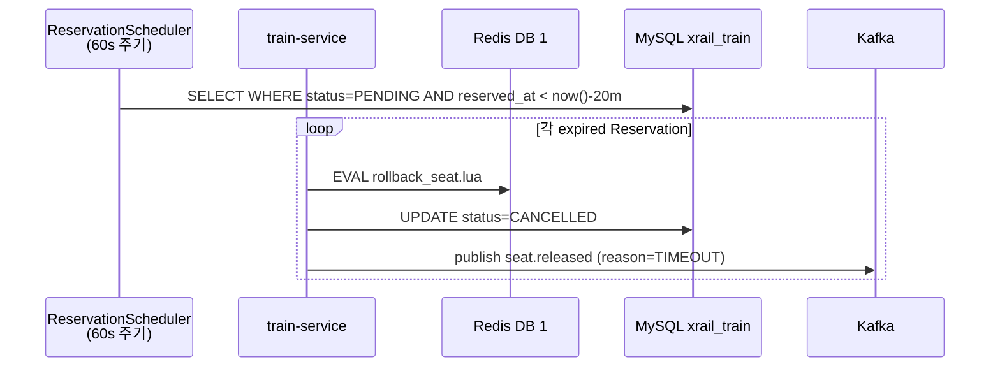

### 6.5 보상 책임 매트릭스

| 시나리오 | 트리거 | 보상 액션 | 발행 이벤트 |
|---------|--------|----------|------------|
| Lua 좌석락 실패 | train-service 동기 | 즉시 부분 rollback + 409 | (없음 — 이벤트 emit 전) |
| 결제 실패 | `payment.failed` | Redis 해제 + Reservation CANCELLED | `seat.released(PAYMENT_FAILED)` |
| 미결제 타임아웃 | `ReservationScheduler` | Redis 해제 + Reservation CANCELLED | `seat.released(TIMEOUT)` |
| 사용자 취소 | `DELETE /api/reservations/{id}` | Redis 해제 + Reservation CANCELLED | `seat.released(USER_CANCELLED)` |
| Redis↔DB 정합 깨짐 | `ReconciliationScheduler` (5m) | 고립된 Redis 비트 해제 | `seat.released(RECONCILE)` |

---

## 7. Kafka 토픽 토폴로지

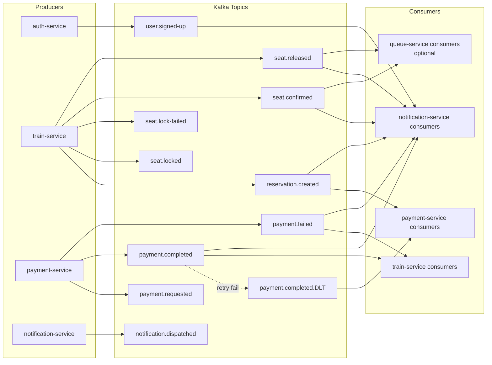

**토픽 정책**
- 고볼륨(`reservation.created`, `payment.completed`, `seat.released`) — partitions=3, key=`reservationId`.
- 저볼륨(`seat.lock-failed`, `user.signed-up`, `payment.requested`) — partitions=1.
- DLT: `payment.completed.DLT` — `DeadLetterPublishingRecoverer`, max 2 retry, 1s backoff.
- 직렬화: JSON (`spring-kafka` + Jackson JSR310). 추후 Schema Registry/Avro로 이전 가능.
- 헤더로 전파: `eventId`, `occurredAt`, `traceId`(Brave `b3`).
- 멱등 컨슈머: train-service의 `payment.completed` 컨슈머는 `Reservation.status=PAID` 이미인 경우 no-op.

---

## 8. 데이터 흐름 및 격리

```mermaid
flowchart TB
    subgraph MySQL["MySQL 8 (single instance)"]
        S1[xrail_auth<br/>users, members,<br/>non_members,<br/>refresh_tokens]
        S2[xrail_train<br/>stations, routes,<br/>route_stations,<br/>trains, carriages, seats,<br/>schedules, reservations, tickets,<br/>reservation_saga_log]
        S3[xrail_payment<br/>payments]
        S4[xrail_notify<br/>notification_logs]
    end

    subgraph Redis["Redis (single, logical DBs)"]
        R0[DB 0<br/>rt:{userId}<br/>refresh-token mirror]
        R1[DB 1<br/>sch:{sId}:seat:{seatId}<br/>Lua bitmask]
        R2[DB 2<br/>queue:waiting:{scope}<br/>queue:active:{scope}:{uid}<br/>queue:scopes]
        R3[DB 3<br/>idempotency:{key}<br/>Redisson bucket]
    end

    AU2[auth-service] --> S1
    AU2 --> R0
    T2[train-service] --> S2
    T2 --> R1
    Q2[queue-service] --> R2
    P2[payment-service] --> S3
    P2 --> R3
    N2[notification-service] --> S4
```

**격리 규칙**
- 각 서비스의 JDBC URL은 자기 스키마만 본다 (별도 DB 사용자 + 권한).
- 크로스 서비스 FK 없음. 사용자 식별은 `userId(Long)` + `userName` 스냅샷.
- Flyway는 서비스별로 자기 스키마에만 적용 (`schemas: xrail_<service>`).
- HikariCP: 로컬 max 30 / prod 100 (서비스당). connection-timeout 30s, idle-timeout 10m.

---

## 9. 관측성 (Observability)

### 9.1 메트릭 — Prometheus + Grafana

각 서비스가 Micrometer로 Prometheus 노출 (`/actuator/prometheus`). 표준 메트릭(JVM, HTTP, HikariCP, Kafka, Redisson) 외에 도메인 커스텀 메트릭을 정의한다.

| 메트릭 | 타입 | 서비스 | 의미 |
|--------|------|--------|------|
| `xrail.queue.waiting.size{scope}` | Gauge | queue-service | 대기 인원 |
| `xrail.queue.active.size{scope}` | Gauge | queue-service | 활성 인원 |
| `xrail.queue.promotions.total` | Counter | queue-service | 누적 승급 수 |
| `xrail.seat.lock.attempt.total` | Counter | train-service | Lua 호출 총수 |
| `xrail.seat.lock.success.total` | Counter | train-service | Lua 성공 수 |
| `xrail.seat.lock.conflict.total` | Counter | train-service | Lua 충돌 수 |
| `xrail.reservation.created.total{status}` | Counter | train-service | PENDING/PAID/CANCELLED |
| `xrail.reservation.pending.size` | Gauge | train-service | 현재 PENDING 개수 |
| `xrail.payment.completed.total` | Counter | payment-service | 결제 성공 |
| `xrail.payment.failed.total` | Counter | payment-service | 결제 실패 |
| `xrail.notification.dispatched.total{channel}` | Counter | notification-service | 채널별 발송 |
| `xrail.saga.compensation.total{reason}` | Counter | train-service | 보상 발동 횟수 |

### 9.2 트레이싱 — Zipkin

- Micrometer Tracing(Brave) 사용. 모든 서비스 + Gateway에 `micrometer-tracing-bridge-brave` + `zipkin-reporter-brave` 의존성.
- HTTP 전파: 자동(`B3` 헤더).
- **Kafka 전파**: `spring-kafka` 3.x에서 자동 안 됨. `brave-instrumentation-kafka-clients`의 `TracingProducerInterceptor` / `TracingConsumerInterceptor` 설정 필요. (train-service, payment-service, notification-service)
- 샘플링: dev 1.0, prod 0.1 권장.
- Definition of Done: 단일 예약의 trace가 `gateway → train → kafka → payment → kafka → train → kafka → notification` 전체 연결.

### 9.3 서킷 브레이커 — Resilience4j

- `resilience4j-spring-boot3` + `resilience4j-reactor`(Gateway).
- Gateway의 downstream call에 `@CircuitBreaker(name="<service>")` + fallback (정적 JSON 응답).
- 서비스 간 동기 호출이 거의 없으므로(주로 Kafka), 주 대상은 Gateway + train-service의 외부 PG mock 호출.
- 노출: `/actuator/circuitbreakers`. 경보: Prometheus alert 룰로 `resilience4j_circuitbreaker_state{state="open"}==1`.

### 9.4 로그

- 포맷: Logback JSON encoder (단일 포맷). `traceId`, `spanId`, `service`, `userId` MDC 주입.
- 집계: 1차에는 docker compose `logs`. 추후 Loki/ELK 도입(deferred).

---

## 10. 배포 & 로컬 개발

### 10.1 docker-compose 토폴로지

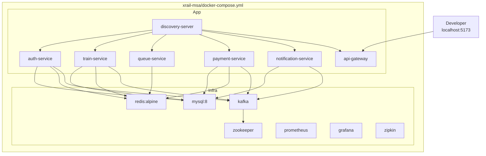

### 10.2 기동 순서

1. **인프라 먼저**: `docker compose up -d mysql redis zookeeper kafka prometheus grafana zipkin`. healthcheck 대기.
2. **레지스트리**: `discovery-server`. `http://localhost:8761` 확인.
3. **비즈니스 서비스 6개**: 병렬 기동. 각각 Eureka 등록 확인.
4. **Gateway**: 마지막. `http://localhost:8080/actuator/health`.
5. **Frontend**: `cd frontend && npm run dev`.

### 10.3 SSE 프록시 주의사항

- Gateway가 reactive(Netty)이므로 `text/event-stream` 응답을 버퍼링하지 않는다. 다만 라우트 메타데이터에:
  - `response-timeout: 0` — 응답 타임아웃 비활성.
  - 필터 `RemoveResponseHeader=Content-Length` — chunked 전송 보장.
- 추후 nginx 앞단에 두면:
  ```
  proxy_buffering off;
  proxy_read_timeout 600s;
  proxy_set_header Connection '';
  proxy_http_version 1.1;
  ```

### 10.4 환경변수 (.env)

| 키 | 사용처 | 비고 |
|----|--------|------|
| `JWT_SECRET` | auth-service, api-gateway | 64자 이상. 두 서비스가 공유. |
| `JWT_ACCESS_TTL_MS` | auth-service | 기본 1800000 (30m) |
| `JWT_REFRESH_TTL_MS` | auth-service | 기본 1209600000 (14d) |
| `KAKAO_CLIENT_ID` / `KAKAO_CLIENT_SECRET` | auth-service | OAuth2 |
| `NAVER_CLIENT_ID` / `NAVER_CLIENT_SECRET` | auth-service | OAuth2 |
| `QUEUE_HMAC_SECRET` | queue-service, train-service | X-Queue-Token 서명/검증 공유 |
| `PAYMENT_MOCK_FAIL` | payment-service | `true`이면 결제 항상 실패(실패 경로 테스트) |
| `MYSQL_ROOT_PASSWORD` | mysql 컨테이너 | docker-compose |
| `EUREKA_DEFAULT_ZONE` | 모든 서비스 | `http://discovery-server:8761/eureka/` |

---

## 11. 보안

| 위협 | 대응 |
|------|------|
| 동일 좌석 동시 예매 | Lua 비트마스크 atomicity + DB pessimistic lock + `@Transactional` |
| Header 스푸핑 (X-User-Id 위조) | Gateway가 inbound X-User-* 헤더 unconditional 제거 후 자체 주입 |
| Replay 공격 (queue token) | HMAC + 짧은 TTL(10분) + 1회용 idempotency |
| 결제 중복 제출 | Idempotency-Key + Redisson 버킷(PROCESSING/COMPLETED) + `@Version` |
| 무차별 가입/큐 등록 | Bucket4j 레이트리미트(Gateway, per-IP) + CAPTCHA |
| JWT 탈취 | Refresh 회전 체인 + Redis 미러로 강제 무효화 가능 |
| OAuth2 redirect 변조 | redirect URI whitelist (kakao/naver 콘솔 등록 + 서버 설정 일치) |
| SQL Injection | Spring Data + QueryDSL (파라미터 바인딩 강제) |
| Kafka payload 변조 | 내부망 한정. 외부 노출 시 SASL + TLS 추가(deferred) |
| 비밀번호 저장 | bcrypt (Spring Security `PasswordEncoder`) |
| CORS | Gateway에서 화이트리스트 (`http://localhost:5173` 등). credentials 명시. |

---

## 12. 확장성 & 장애 격리

| 부하 증가 시 | 스케일 전략 |
|-------------|------------|
| 대기열 폭증 | queue-service 수평 확장 (Redis는 공유). SSE emitter 분산 → 동일 userId가 다른 인스턴스 붙어도 Redis 상태로 일관성 유지. |
| 좌석 락 경합 | train-service 수평 확장. Lua가 atomic이므로 instance 수 무관. DB connection pool이 1차 병목 — HikariCP 튜닝 + read replica 도입 검토. |
| 결제 처리 지연 | payment-service 수평 확장. Kafka consumer group 파티션 수 만큼 병렬 처리. |
| 알림 폭주 | notification-service 수평 확장. 채널 어댑터별 backpressure (Resilience4j bulkhead). |

| 장애 시나리오 | 격리 메커니즘 |
|-------------|--------------|
| payment-service down | reservation은 PENDING으로 머묾 → 20분 후 ReservationScheduler가 TIMEOUT 보상 |
| Redis down | train-service 503 (좌석 락 불가). queue-service 503. auth-service는 refresh 미러 잃지만 DB로 fallback. |
| Kafka down | producer side는 retry + DLQ. consumer lag 누적 → 알림. saga 진행은 일시 중단. |
| MySQL down | 모든 stateful 서비스 503. |
| Gateway down | SPA에서 직접 접근 불가 — 1차에서는 단일 포인트 (HA는 deferred). |

---

## 13. 디렉터리 레이아웃 (참고)

```
xrail-msa/
├── settings.gradle
├── build.gradle
├── gradle.properties
├── docker-compose.yml
├── docker/
│   ├── mysql/init/
│   │   ├── 01-create-schemas.sql
│   │   └── 02-create-users.sql
│   ├── prometheus.yml
│   └── grafana/provisioning/
├── docs/
│   ├── PRD.md
│   ├── API.md
│   ├── ERD.md
│   └── ARCHITECTURE.md  ← 이 문서
├── common-lib/
│   └── src/main/java/com/xrail/common/
│       ├── dto/ApiResponse.java
│       ├── entity/BaseTimeEntity.java
│       ├── exception/{BusinessException, ErrorCode, GlobalExceptionHandlerSupport}.java
│       ├── header/Headers.java
│       └── kafka/
│           ├── Topics.java
│           └── event/*.java  (9개 record)
├── discovery-server/
├── api-gateway/
├── auth-service/
├── train-service/
├── queue-service/
├── payment-service/
├── notification-service/
└── frontend/  (React 19 + Vite + TS, XRail에서 이동)
```

---

## 14. 의사결정 로그 (Decision Log)

| # | 결정 | 대안 | 사유 |
|---|------|------|------|
| D1 | 콘서트 도메인 폐기 | 멀티 도메인 공존 | 제품 정체성 단순화. ticketing은 인프라/패턴만 흡수. |
| D2 | MSA (6 서비스) | 모놀리스 / 모듈 모놀리스 | 학습/포트폴리오 가치 + 도메인별 스케일링. |
| D3 | Spring Cloud Gateway + Eureka | Kong / K8s Ingress / Consul | Spring 생태계 결합도 최고. |
| D4 | Gateway에서 JWT 검증 | 서비스별 검증 / auth-service 위임 | downstream 단순화. 네트워크 홉 절감. |
| D5 | Database per service (스키마 격리) | DB per instance / Shared DB | 로컬 부담 ↓ + 격리 충분. 프로덕션 분리 가능. |
| D6 | common-lib (모노레포) | 서비스별 복제 / Schema Registry | 9개 이벤트 + 헤더 상수 휴면 비용 ↓. |
| D7 | Saga Choreography | Orchestration | 의존도 ↓. 디버깅은 `reservation_saga_log` 테이블로 보완. |
| D8 | React SPA 단일 | Thymeleaf 혼용 | 일관된 UX + 모던 스택. |
| D9 | SSE (WebSocket 폐기) | WebSocket / Polling-only | 단방향이면 충분 + HTTP 인프라 친화. polling fallback으로 안정성 확보. |
| D10 | Lua 비트마스크 유지 (Redisson lock 미사용) | Redisson RLock per seat | segment 단위 좌석은 비트마스크가 정밀. |
| D11 | SpringDoc OpenAPI 미채택 | OpenAPI 자동 생성 | 수동 API.md로 충분. 사용자 명시 결정. |

---

## 15. 미결 사항

다음 항목은 PRD 합의 단계 또는 구현 단계 초입에 결정한다.

1. Guest(NonMember)도 큐를 거치는가? (현 가정: yes)
2. Refresh token 단일 logout-all 엔드포인트 필요 여부.
3. Zipkin 프로덕션 sampling rate (0.1 권장).
4. `seat.confirmed`를 좌석맵 SPA에 라이브 푸시할지 (다른 사용자에게).
5. CAPTCHA 실 프로바이더 (reCAPTCHA v3 / hCaptcha).
6. PG 실 연동 시점 및 어댑터.
7. HA 시점: Gateway/Eureka 이중화, MySQL replica, Kafka 3 broker.

---

**End of ARCHITECTURE.md**
