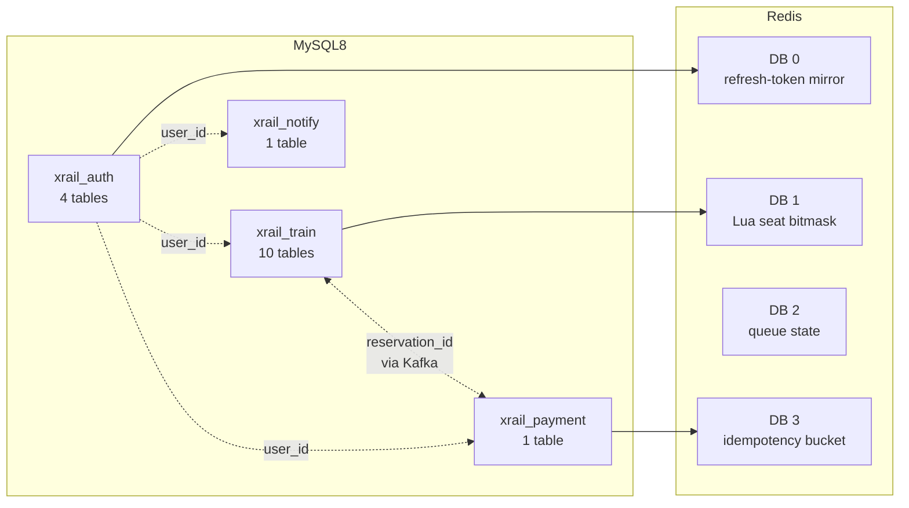
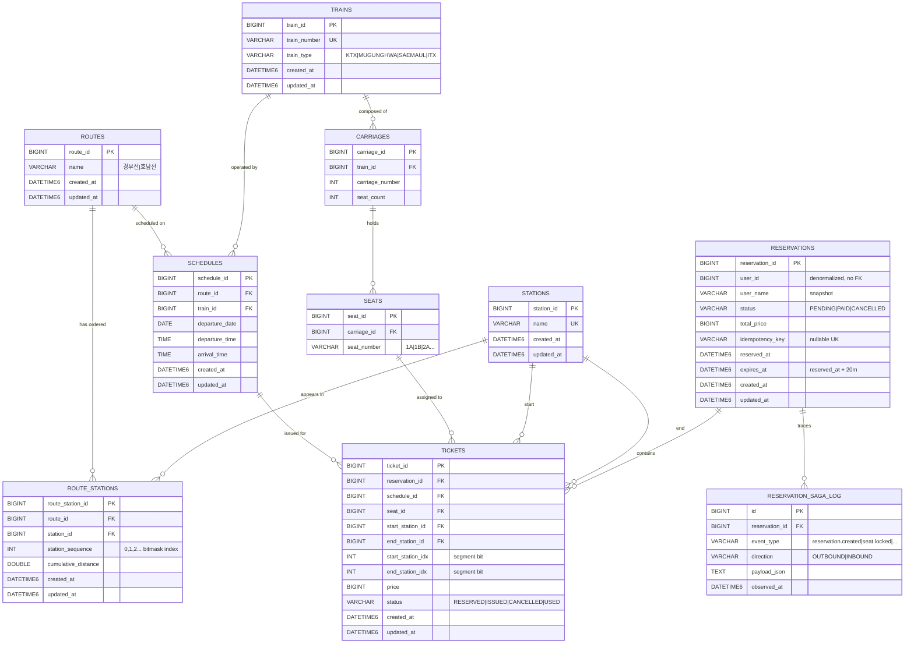
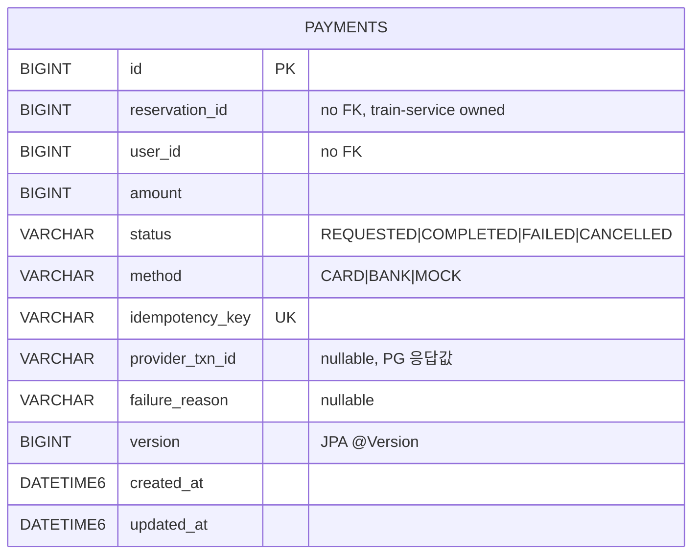
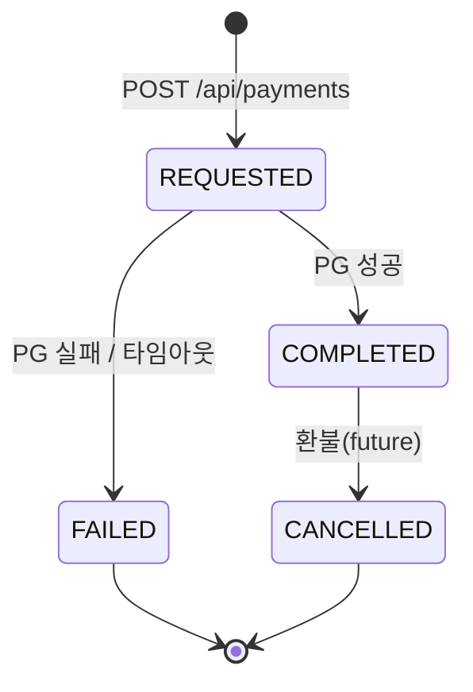
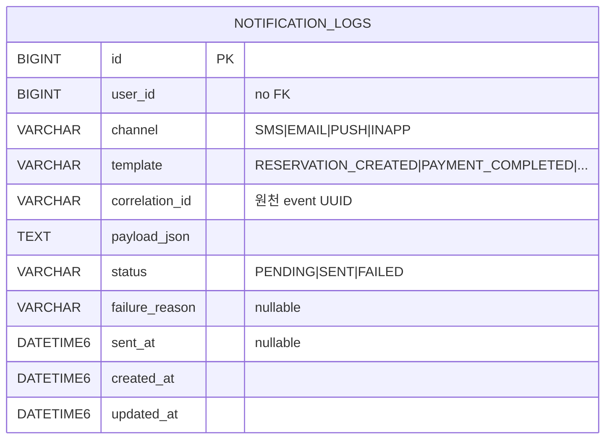
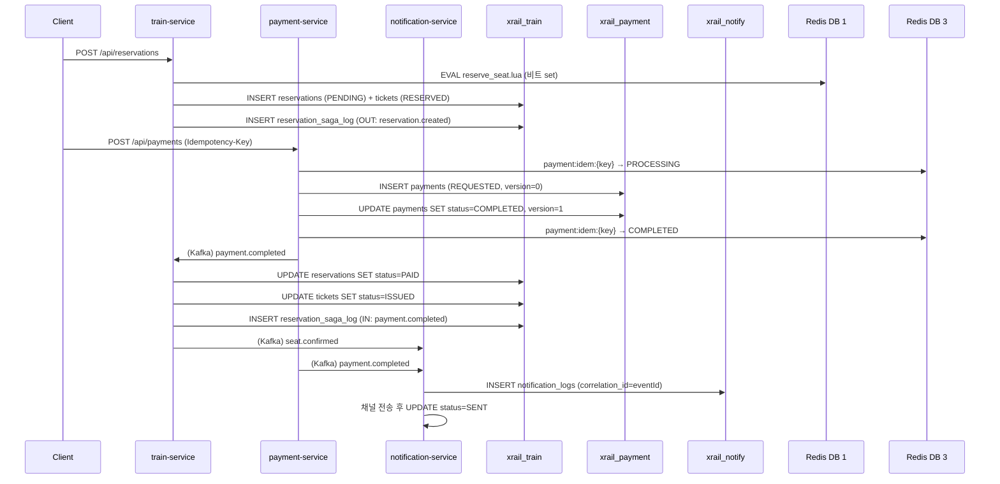

# XRail MSA — Entity Relationship Diagram

> 이 문서는 MSA 4개 서비스(`auth-service`, `train-service`, `payment-service`, `notification-service`)가 소유하는 MySQL 스키마 + Redis 키 설계를 정의한다. `queue-service`는 Redis 전용이므로 RDB 섹션이 없다.
>
> 원칙:
> - **Database per service**: 단일 MySQL 인스턴스 내에서 스키마(`xrail_auth`, `xrail_train`, `xrail_payment`, `xrail_notify`)로 격리. 서비스별 별도 DB 계정 + GRANT.
> - **크로스 스키마 FK 없음**: 사용자 식별은 `user_id (BIGINT)` + 필요 시 `user_name` 스냅샷. 다른 서비스로의 참조는 ID + 도메인 이벤트로.
> - **공통 컬럼**: 모든 비즈니스 테이블에 `created_at DATETIME(6)`, `updated_at DATETIME(6)` (Spring JPA Auditing). PK는 `BIGINT AUTO_INCREMENT`.

---

## 0. 스키마 분포 한눈에

| 스키마 | 서비스 | 테이블 수 | 핵심 책임 |
|--------|--------|-----------|----------|
| `xrail_auth` | auth-service | 4 | 회원/비회원/리프레시 토큰 |
| `xrail_train` | train-service | 10 | 노선/스케줄/예약/티켓 + saga log |
| `xrail_payment` | payment-service | 1 | 결제 트랜잭션 |
| `xrail_notify` | notification-service | 1 | 알림 로그 |



---

## 1. 스키마 `xrail_auth` (auth-service)

### 1.1 ER 다이어그램

```mermaid
erDiagram
    USERS ||--o| MEMBERS : "JOINED inheritance"
    USERS ||--o| NON_MEMBERS : "JOINED inheritance"
    USERS ||--o{ REFRESH_TOKENS : "issues"

    USERS {
        BIGINT user_id PK
        VARCHAR dtype "MEMBER|NON_MEMBER"
        VARCHAR role "ROLE_MEMBER|ROLE_ADMIN|ROLE_NON_MEMBER"
        DATETIME6 created_at
        DATETIME6 updated_at
    }

    MEMBERS {
        BIGINT user_id PK_FK
        VARCHAR login_id UK "nullable for social-only"
        VARCHAR password_hash "bcrypt"
        VARCHAR name
        VARCHAR email UK
        VARCHAR phone
        VARCHAR birth_date "YYYYMMDD"
        VARCHAR social_provider "KAKAO|NAVER|null"
        VARCHAR social_id "provider userId"
    }

    NON_MEMBERS {
        BIGINT user_id PK_FK
        VARCHAR name
        VARCHAR phone
        VARCHAR password "4-6 digits"
        VARCHAR access_code UK "10자 nanoid"
    }

    REFRESH_TOKENS {
        BIGINT id PK
        BIGINT user_id FK
        VARCHAR token_hash UK "SHA-256"
        DATETIME6 expires_at
        BIGINT rotated_from "직전 토큰 id, nullable"
        VARCHAR ip_address
        VARCHAR user_agent
        DATETIME6 created_at
        DATETIME6 revoked_at "nullable"
    }
```

### 1.2 테이블 상세

**`users` (베이스 — JPA JOINED 상속)**

| 컬럼 | 타입 | 제약 | 비고 |
|------|------|------|------|
| `user_id` | BIGINT AUTO_INCREMENT | PK | 모든 도메인이 참조하는 글로벌 ID |
| `dtype` | VARCHAR(31) | NOT NULL | `Member` / `NonMember` 디스크리미네이터 |
| `role` | VARCHAR(20) | NOT NULL | `ROLE_MEMBER`, `ROLE_ADMIN`, `ROLE_NON_MEMBER` |
| `created_at` / `updated_at` | DATETIME(6) | — | JPA Auditing |

**`members` (회원 서브)**

| 컬럼 | 타입 | 제약 | 비고 |
|------|------|------|------|
| `user_id` | BIGINT | PK, FK → users.user_id | PK 공유 |
| `login_id` | VARCHAR(50) | UNIQUE, nullable | 소셜 전용이면 NULL |
| `password_hash` | VARCHAR(255) | NOT NULL | bcrypt (10 rounds). 소셜 전용이면 더미 |
| `name` | VARCHAR(50) | NOT NULL | — |
| `email` | VARCHAR(100) | UNIQUE NOT NULL | — |
| `phone` | VARCHAR(20) | nullable | — |
| `birth_date` | VARCHAR(8) | nullable | YYYYMMDD |
| `social_provider` | VARCHAR(20) | nullable | `KAKAO`, `NAVER` |
| `social_id` | VARCHAR(100) | nullable | 프로바이더 userId |

인덱스:
- `idx_members_social` ON `(social_provider, social_id)` — 소셜 로그인 시 lookup.

**`non_members` (비회원 서브)**

| 컬럼 | 타입 | 제약 | 비고 |
|------|------|------|------|
| `user_id` | BIGINT | PK, FK → users.user_id | PK 공유 |
| `name` | VARCHAR(50) | NOT NULL | — |
| `phone` | VARCHAR(20) | NOT NULL | — |
| `password` | VARCHAR(6) | NOT NULL | 4~6자 숫자 (자체 bcrypt 처리) |
| `access_code` | VARCHAR(10) | UNIQUE NOT NULL | 예매 조회용 nanoid |

인덱스: `idx_non_member_access` ON `(access_code)` — 비회원 로그인 시 lookup.

**`refresh_tokens` (리프레시 토큰 회전 체인) — 신규**

| 컬럼 | 타입 | 제약 | 비고 |
|------|------|------|------|
| `id` | BIGINT AUTO_INCREMENT | PK | — |
| `user_id` | BIGINT | FK → users.user_id NOT NULL | — |
| `token_hash` | VARCHAR(64) | UNIQUE NOT NULL | 평문 저장 금지 → SHA-256 |
| `expires_at` | DATETIME(6) | NOT NULL | 발급 + 14d |
| `rotated_from` | BIGINT | nullable | 회전 직전 토큰 id (체인 추적용) |
| `ip_address` | VARCHAR(45) | nullable | IPv6 대비 45자 |
| `user_agent` | VARCHAR(255) | nullable | — |
| `created_at` | DATETIME(6) | NOT NULL | — |
| `revoked_at` | DATETIME(6) | nullable | 명시 폐기 시 |

인덱스: `idx_refresh_user` ON `(user_id, expires_at)` — 만료 정리 + 사용자별 활성 토큰 조회.

> **Redis 미러** (DB 0): `rt:{userId}` → `{tokenHash, expiresAt}`, TTL 14d. 검증 시 Redis 우선 lookup → miss 시 RDB fallback + Redis 복원.

---

## 2. 스키마 `xrail_train` (train-service) — 최대 스키마

### 2.1 ER 다이어그램



### 2.2 테이블 상세 (변경 포인트 위주)

대부분의 테이블은 XRail의 `V1__init_schema.sql`을 그대로 계승한다. **MSA 전환을 위한 변경**만 따로 표시한다.

**`reservations` — 변경 사항**

| 컬럼 | 타입 | 제약 | 변경 | 비고 |
|------|------|------|------|------|
| `reservation_id` | BIGINT AUTO_INCREMENT | PK | (유지) | — |
| `user_id` | BIGINT | NOT NULL | **FK 제거** | 크로스 스키마라 FK 불가. 단순 ID 컬럼. |
| `user_name` | VARCHAR(50) | nullable | **신규** | Gateway 헤더 `X-User-Name` 스냅샷. 사용자가 추후 개명해도 과거 행은 유지. |
| `status` | VARCHAR(20) | NOT NULL | (유지) | `PENDING`, `PAID`, `CANCELLED` |
| `total_price` | BIGINT | NOT NULL | (유지) | — |
| `idempotency_key` | VARCHAR(100) | UNIQUE nullable | **신규** | `POST /api/reservations` 중복 방지. `(user_id, idempotency_key)` 5분 Redis 캐시 보강. |
| `reserved_at` | DATETIME(6) | NOT NULL | (유지) | — |
| `expires_at` | DATETIME(6) | NOT NULL | **신규** | `reserved_at + 20m`. `ReservationScheduler`가 이걸로 만료 판정. |

인덱스:
- 기존 `(user_id)` 인덱스 유지(예약 목록 조회).
- **신규** `idx_reservation_expire` ON `(status, expires_at)` — PENDING 만료 스캔 효율화.
- **신규** `idx_reservation_idem` ON `(user_id, idempotency_key)` — 중복 차단 lookup.

**`tickets` — 변경 사항**

| 컬럼 | 타입 | 제약 | 비고 |
|------|------|------|------|
| (전 컬럼 유지) | — | — | XRail 그대로 |

추가 인덱스:
- 기존 `idx_ticket_segment` ON `(schedule_id, seat_id)` 유지 — 구간 겹침 체크 핵심.
- **신규** `idx_ticket_status` ON `(status)` — reconcile 스캔용.

**`reservation_saga_log` (신규) — Saga 디버깅 추적**

| 컬럼 | 타입 | 제약 | 비고 |
|------|------|------|------|
| `id` | BIGINT AUTO_INCREMENT | PK | — |
| `reservation_id` | BIGINT | NOT NULL FK → reservations | — |
| `event_type` | VARCHAR(50) | NOT NULL | `reservation.created`, `seat.locked`, `payment.completed`, ... |
| `direction` | VARCHAR(10) | NOT NULL | `OUTBOUND`(emit) / `INBOUND`(consume) |
| `payload_json` | TEXT | NOT NULL | 직렬화된 이벤트 |
| `observed_at` | DATETIME(6) | NOT NULL | — |

인덱스: `idx_saga_reservation` ON `(reservation_id, observed_at)` — 단일 예약의 saga 흐름 시계열 조회.

> 비고: 이 테이블은 디버깅용. Choreography 방식에서 흐름 가시화가 어려운 점을 보완. 운영 중 비활성 토글 가능.

### 2.3 Lua 비트마스크 인덱스 매핑 (Reference)

`route_stations.station_sequence`는 0부터 시작. 한 노선의 모든 역에 0,1,2,... 부여.

| 역 | sequence | 의미 |
|----|---------|------|
| 서울 | 0 | 출발 가능, 도착 불가 |
| 광명 | 1 | — |
| 천안아산 | 2 | — |
| 대전 | 3 | — |
| 동대구 | 4 | — |
| 부산 | 5 | 도착 가능, 출발 불가 |

티켓의 segment 비트 인덱스 = `[startStationIdx, endStationIdx - 1]`. 예: 서울(0) → 대전(3) 티켓은 비트 0, 1, 2를 잡는다.
Redis 키 `sch:{scheduleId}:seat:{seatId}`의 비트열을 `SETBIT` Lua로 atomic 처리.

---

## 3. 스키마 `xrail_payment` (payment-service)

### 3.1 ER 다이어그램



### 3.2 테이블 상세

**`payments`**

| 컬럼 | 타입 | 제약 | 비고 |
|------|------|------|------|
| `id` | BIGINT AUTO_INCREMENT | PK | — |
| `reservation_id` | BIGINT | NOT NULL | train-service 소유. FK 없음. |
| `user_id` | BIGINT | NOT NULL | auth-service 소유. FK 없음. |
| `amount` | BIGINT | NOT NULL | 원 단위 |
| `status` | VARCHAR(20) | NOT NULL | `REQUESTED` → `COMPLETED` / `FAILED` / `CANCELLED` |
| `method` | VARCHAR(20) | NOT NULL | `CARD`, `BANK`, `MOCK` |
| `idempotency_key` | VARCHAR(100) | UNIQUE NOT NULL | 클라이언트 `Idempotency-Key` 헤더 |
| `provider_txn_id` | VARCHAR(100) | nullable | PG 거래번호 |
| `failure_reason` | VARCHAR(255) | nullable | 실패 원인 분류 코드 + 메시지 |
| `version` | BIGINT | NOT NULL DEFAULT 0 | **JPA `@Version`** — 동일 idempotency-key 동시 confirm 방지 |
| `created_at` / `updated_at` | DATETIME(6) | NOT NULL | — |

인덱스:
- `uk_payments_idem` ON `(idempotency_key)` — 중복 차단.
- `idx_payments_reservation` ON `(reservation_id)` — 한 예약의 결제 이력 조회.
- `idx_payments_user_status` ON `(user_id, status, created_at)` — 사용자별 결제 목록.

### 3.3 상태 전이



---

## 4. 스키마 `xrail_notify` (notification-service)

### 4.1 ER 다이어그램



### 4.2 테이블 상세

**`notification_logs`**

| 컬럼 | 타입 | 제약 | 비고 |
|------|------|------|------|
| `id` | BIGINT AUTO_INCREMENT | PK | — |
| `user_id` | BIGINT | NOT NULL | — |
| `channel` | VARCHAR(20) | NOT NULL | `SMS`, `EMAIL`, `PUSH`, `INAPP` |
| `template` | VARCHAR(50) | NOT NULL | `RESERVATION_CREATED`, `PAYMENT_COMPLETED`, `PAYMENT_FAILED`, `SEAT_RELEASED_TIMEOUT`, `WELCOME` |
| `correlation_id` | VARCHAR(36) | NOT NULL | 원천 Kafka 이벤트 `eventId` (UUID). 중복 발송 차단용 |
| `payload_json` | TEXT | NOT NULL | 템플릿 변수 |
| `status` | VARCHAR(10) | NOT NULL | `PENDING` → `SENT` / `FAILED` |
| `failure_reason` | VARCHAR(255) | nullable | — |
| `sent_at` | DATETIME(6) | nullable | — |
| `created_at` / `updated_at` | DATETIME(6) | NOT NULL | — |

인덱스:
- `uk_notify_correlation` ON `(correlation_id, channel)` — 같은 이벤트의 같은 채널 재발송 차단.
- `idx_notify_user` ON `(user_id, created_at DESC)` — 사용자 알림 목록.

---

## 5. Redis 키 설계 (전체)

서비스별 logical DB로 격리. Redisson 클라이언트의 `database` 프로퍼티로 지정.

### 5.1 DB 0 — auth-service

| 키 패턴 | 타입 | TTL | 용도 |
|---------|------|-----|------|
| `rt:{userId}` | String (JSON) | 14d | 리프레시 토큰 해시 미러 (`{tokenHash, expiresAt, ip}`) |
| `bl:access:{jti}` | String | 30m | 명시 폐기된 access JWT의 jti 블랙리스트 (옵션) |

### 5.2 DB 1 — train-service

| 키 패턴 | 타입 | TTL | 용도 |
|---------|------|-----|------|
| `sch:{scheduleId}:seat:{seatId}` | String (binary bitmap) | 24h | **Lua 비트마스크 좌석락**. 비트 인덱스 = `[startStationIdx, endStationIdx-1]` |
| `reservation:idem:{userId}:{idemKey}` | String | 5m | `POST /api/reservations` Idempotency-Key → reservationId |

**Lua 스크립트 키 사용 규칙**
- `reserve_seat.lua`: `KEYS=[sch:{sId}:seat:{seatId}]`, `ARGV=[startIdx, endIdx]`. 비트 검사 + 세팅 atomic.
- `rollback_seat.lua`: 동일 키 + ARGV로 비트 해제.

### 5.3 DB 2 — queue-service

| 키 패턴 | 타입 | TTL | 용도 |
|---------|------|-----|------|
| `queue:waiting:{scope}` | Sorted Set | 없음 | score=등록 epoch ms, member=userId |
| `queue:active:{scope}:{userId}` | String | 10m | 활성 토큰 (값=HMAC token). **반환(삭제) 트리거 3가지**: ① `reservation.created` 수신(조기 반환 — release.lua가 ABA/skew 가드 후 원자 삭제) ② `POST /leave`(자발 이탈) ③ TTL 만료(no-show 폴백). TTL은 토큰 HMAC exp와 동일 값 유지 필수(단독 단축 시 INV-2 붕괴) |
| `queue:active:set:{scope}` | Sorted Set | 없음(원소별 score=슬롯 만료 epoch ms) | 동시 active 인원 카운팅. member=userId. promote.lua·즉시입장 Lua가 `ZREMRANGEBYSCORE 0 now`로 만료분을 정리한 뒤 용량(maxActive) 판정. `reservation.created`/leave 시 ZREM |
| `queue:active:first:{scope}:{userId}` | String | session-cap + active-ttl + 60s (기본 ≈21분) | 재발급 세션 절대 상한(§4.6)용 세션 최초 issuedAt(epoch ms). 새 세션 admit 시 **무조건 SET(덮어쓰기, SETNX 금지)**, 재발급 admit에서는 불변, 슬롯 반환(release.lua)·leave 시 DEL |
| `queue:scopes` | Set | 없음 | 활성 scope 목록 (스케줄러 순회 대상) |
| `queue:idem:{idemKey}` | String | 5m | `POST /api/queue/token` 중복 등록 차단 |
| `queue:emitter:{scope}:{userId}` | (in-memory ConcurrentMap, **Redis 아님**) | 인스턴스 lifetime | SSE 연결 — 동일 userId 다중 인스턴스 보호는 Redis pub/sub로 추후 보완 |

> 1차에서는 SSE emitter 분산이 비필수 (단일 queue-service 인스턴스 가정). 수평 확장 시 Redis pub/sub의 채널 `queue:promoted:{scope}`로 fanout 추가.

**Lua 스크립트 키 사용 규칙 (대기열 진입 제어 A — QUEUE_ADMISSION_REDESIGN.md)**
- `promote.lua`: `KEYS=[queue:waiting:{scope}, queue:active:set:{scope}]`, `ARGV=[maxActive, batchSize, now, expiresAt]`. 만료분 정리 → 빈 자리만큼만(top-n) waiting→active 원자 이동. 토큰 발급·버킷 SET은 Java(반환된 uid, issuedAt=ARGV now).
- `release.lua`: `KEYS=[queue:active:{scope}:{uid}, queue:active:set:{scope}, queue:active:first:{scope}:{uid}]`, `ARGV=[uid, occurredAtMs, skewMarginMs]`. 버킷 부재 skip + ABA/클록 skew 가드 + ZREM/DEL 원자 실행.

### 5.4 DB 3 — payment-service

| 키 패턴 | 타입 | TTL | 용도 |
|---------|------|-----|------|
| `payment:idem:{idemKey}` | Hash | 30m | `{status: PROCESSING|COMPLETED, paymentId, startedAt}`. Redisson RLock으로 동시 진입 방지. |
| `payment:lock:{idemKey}` | String | 60s | Redisson 분산 락 키 (자동 갱신 watchdog) |

---

## 6. 데이터 생애주기

### 6.1 예약 한 건의 데이터 흐름



### 6.2 정합화(Reconciliation)

`ReservationReconciliationScheduler` (5분 주기) 의사 코드:

```
for each schedule_id with active bitmask in Redis DB 1:
    for each seat with set bits:
        bits_in_redis = GET sch:{schedule_id}:seat:{seat_id}
        bits_in_db    = OR of all tickets WHERE status IN ('RESERVED','ISSUED')
                                          AND schedule_id=? AND seat_id=?
                                          → reconstruct bitmask from start/end idx
        if bits_in_redis ⊃ bits_in_db:
            phantom = bits_in_redis & ~bits_in_db
            EVAL rollback_seat.lua to clear `phantom` bits
            emit seat.released(reason=RECONCILE)
```

---

## 7. 마이그레이션 파일 (Flyway)

각 서비스가 자기 스키마의 마이그레이션만 보유.

```
auth-service/src/main/resources/db/migration/
  V1__init_auth.sql        -- users, members, non_members, refresh_tokens
  V2__seed_admin.sql       -- (선택) 어드민 계정 시드

train-service/src/main/resources/db/migration/
  V1__init_train.sql       -- stations, routes, route_stations, trains, carriages, seats, schedules
  V2__init_reservation.sql -- reservations, tickets, reservation_saga_log
  V3__seed_master.sql      -- (개발용) DataInitializer 대체 시드

payment-service/src/main/resources/db/migration/
  V1__init_payment.sql     -- payments

notification-service/src/main/resources/db/migration/
  V1__init_notify.sql      -- notification_logs
```

Flyway 설정 (각 서비스 `application.yaml`):
```yaml
spring:
  flyway:
    enabled: true
    schemas: xrail_<service>
    default-schema: xrail_<service>
    baseline-on-migrate: true
```

---

## 8. DB 계정 권한 (참고)

`docker/mysql/init/02-create-users.sql`:

```sql
CREATE USER 'xrail_auth'@'%' IDENTIFIED BY '${AUTH_DB_PASSWORD}';
GRANT ALL PRIVILEGES ON xrail_auth.* TO 'xrail_auth'@'%';

CREATE USER 'xrail_train'@'%' IDENTIFIED BY '${TRAIN_DB_PASSWORD}';
GRANT ALL PRIVILEGES ON xrail_train.* TO 'xrail_train'@'%';

CREATE USER 'xrail_payment'@'%' IDENTIFIED BY '${PAYMENT_DB_PASSWORD}';
GRANT ALL PRIVILEGES ON xrail_payment.* TO 'xrail_payment'@'%';

CREATE USER 'xrail_notify'@'%' IDENTIFIED BY '${NOTIFY_DB_PASSWORD}';
GRANT ALL PRIVILEGES ON xrail_notify.* TO 'xrail_notify'@'%';

FLUSH PRIVILEGES;
```

각 서비스 JDBC URL은 자기 계정만 사용 → 크로스 스키마 접근 차단.

---

## 9. ID 발급 전략

- **`BIGINT AUTO_INCREMENT`** (현 XRail 동일). 서비스별로 독립 시퀀스 → 충돌 없음.
- 단점: 분산 시스템에서 ID로 라우팅 불가. 1차 규모에서는 무관.
- 차후 트래픽 증가 시 옵션:
  - Snowflake-like (서비스별 worker_id 부여)
  - UUIDv7 (시간 정렬 + 분산 안전)

---

## 10. 데이터 크기 추정 (참고)

가정: 일 평균 1만 예약, 좌석당 평균 2 segment, 운영 1년.

| 테이블 | 행 수 | 평균 행 크기 | 1년 크기 |
|--------|------|-------------|---------|
| `reservations` | 3.65M | ~150 B | ~550 MB |
| `tickets` | 7.3M | ~200 B | ~1.5 GB |
| `payments` | 3.65M | ~200 B | ~750 MB |
| `notification_logs` | 14.6M (예약당 평균 4건) | ~500 B | ~7.3 GB |
| `reservation_saga_log` | 36M (예약당 평균 10 event) | ~400 B | ~14 GB |

→ `reservation_saga_log`는 90일 이후 cold storage 이전 정책 권장 (deferred).

---

**End of ERD.md**
