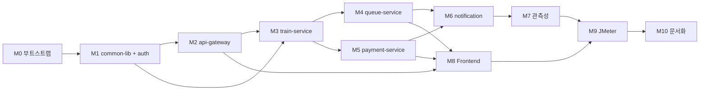

# XRail MSA — Product Requirements Document

> **문서 메타**
> - 작성일: 2026-05-14
> - 작성자: 김윤호 (rladbsgh27@gmail.com)
> - 상태: Draft v1.0
> - 관련 문서: [ARCHITECTURE.md](./ARCHITECTURE.md), [ERD.md](./ERD.md), [API.md](./API.md)

---

## 1. 배경 (Background)

### 1.1 현재 상황

현재 두 개의 독립 Spring Boot 프로젝트가 운영되고 있다.

| 프로젝트 | 도메인 | 핵심 강점 | 약점 |
|---------|--------|----------|------|
| **XRail** | 기차 예매 | 풍부한 도메인 모델(노선/구간/스케줄), JWT + OAuth2 인증, Lua 비트마스크 기반의 정밀한 segment 좌석락 | 관측성 부재(Actuator만), 테스트 부족, Kafka 활용 얕음 |
| **ticketing-system** | 콘서트 예매 | 검증된 1,000 동접 부하 처리, Kafka write-behind, Prometheus + Grafana + Zipkin 풀스택 관측성, JMeter 부하 자산 | 단순한 도메인(Concert/Seat 2개), 인증 stub 수준 |

두 시스템은 **Java 21 / Spring Boot 3.4.x / MySQL 8 / Redis(Redisson) / Kafka**라는 거의 동일한 인프라 위에 있지만, 도메인 깊이와 운영 성숙도가 서로 보완 관계에 있다.

### 1.2 통합 필요성

- **포트폴리오 일관성**: 두 프로젝트가 중복된 인프라를 들고 있어 학습/유지보수 비용이 이중으로 든다. 단일 제품으로 합치면 운영 자산을 한곳에 집중할 수 있다.
- **MSA 학습 가치**: 도메인이 다른 두 시스템을 단순 합치기보다, "기차 예매 단일 제품"으로 정체성을 잡고 MSA 패턴(서비스 분리·Saga·이벤트 기반 통신)을 정식 적용하면 한 단계 위의 학습이 된다.
- **운영 자산의 이식**: ticketing-system이 검증한 부하 처리·관측성 자산을 XRail의 풍부한 도메인 위에 얹으면 **production-grade 고동시성 예매 플랫폼**을 만들 수 있다.

### 1.3 왜 콘서트가 아니라 기차인가

- 기차 도메인이 더 풍부(노선·구간·시간표·열차 종류)하여 학습 가치가 크다.
- 기차의 segment 단위 좌석 알고리즘(Lua 비트마스크)은 콘서트의 단순 좌석 락보다 기술적으로 흥미롭고 차별화된다.
- 콘서트 도메인은 인프라 패턴(Kafka, 관측성, 큐) 위주이므로 **흡수 가능**하지만, 기차 도메인은 비즈니스 로직이므로 흡수가 어렵다.

→ **콘서트 도메인 폐기, 기차 단일 제품 + ticketing-system의 인프라/패턴 흡수**.

---

## 2. 문제 정의 (Problem Statement)

> "고동시성 환경에서 기차 좌석을 segment 단위로 안전하게 예매할 수 있는 서비스를, 운영·관측 가능한 MSA로 제공한다."

### 2.1 해결할 핵심 문제

1. **좌석 중복 예매 방지**: 동일 좌석·동일 구간을 두 사용자가 동시에 누르면 정확히 한 명만 성공해야 한다. (1,000 동접 검증 필수)
2. **트래픽 폭증 흡수**: 인기 노선 오픈 시점에 DB 풀이 마르지 않도록 대기열로 게이트한다.
3. **결제 정합성**: 결제와 좌석 확정이 분산 트랜잭션이지만 최종적으로 일관(eventually consistent)해야 한다. 미결제 좌석은 자동 해제.
4. **MSA 운영 가시성**: 서비스 6개 + 인프라 4개 환경에서 어떤 요청이 어디서 막혔는지 즉시 파악 가능해야 한다.

### 2.2 해결하지 않을 문제 (Non-goals)

- 실 PG 연동 (1차에서는 mock)
- 환불·부분 취소 (1차에서는 단순 취소만)
- 실시간 좌석맵 라이브 갱신 (다른 사용자의 예약을 내 화면에서 즉시 보기) — deferred
- 다국어 지원, A11y 인증 — deferred
- 모바일 네이티브 앱
- 관리자 대시보드의 운영 자동화 (단순 통계 조회만)

---

## 3. 목표 (Goals)

### 3.1 비즈니스 목표

| # | 목표 | 측정 지표 |
|---|------|----------|
| B1 | 좌석 중복 예매 0건 | 1,000 동접 부하에서 overbooking = 0 |
| B2 | 트래픽 폭증에도 응답 안정 | p95 응답 < 800ms, error rate < 1% (1,000 user JMeter) |
| B3 | 결제 saga 정합성 | 24시간 운영 후 RDB-Redis 정합화 보정 건수 < 0.1% |
| B4 | 운영 관찰 가능성 | 단일 예약의 trace가 6 서비스에 걸쳐 전체 연결, 대시보드 즉시 진단 가능 |

### 3.2 기술 목표

| # | 목표 |
|---|------|
| T1 | Spring Cloud Gateway + Eureka 기반 MSA, 6개 비즈니스 서비스 |
| T2 | Saga Choreography (Kafka 이벤트 연쇄)로 분산 트랜잭션 처리 |
| T3 | Lua 비트마스크 + DB 더블체크 + 재정합화 스케줄러 3중 안전망 |
| T4 | 인증은 Gateway에서 단일 검증, downstream은 헤더 신뢰 |
| T5 | Database per service (스키마 격리), 크로스 FK 없음 |
| T6 | Prometheus + Grafana + Zipkin + Resilience4j 풀스택 관측성 |
| T7 | WebSocket 폐기, SSE + polling fallback으로 대기열 알림 |
| T8 | JMeter 1,000 동접 시나리오 통과 |

---

## 4. 이해관계자 (Stakeholders)

| 역할 | 책임 | 비고 |
|------|------|------|
| **제품 오너 / 개발자** | 전체 설계·구현 | 김윤호 (1인 프로젝트) |
| **사용자 (Member)** | 회원가입 + 예매 + 결제 | 평시 시나리오 |
| **사용자 (NonMember)** | 비회원 1회성 예매 | accessCode + 전화번호 + 비밀번호 |
| **관리자 (Admin)** | 스케줄 등록·통계 조회 | 1차에는 최소 기능 |
| **외부 OAuth 공급자** | Kakao, Naver | redirect URI는 Gateway |
| **외부 PG (가상)** | 결제 처리 | 1차에는 mock, 실 연동 deferred |
| **DevOps (셀프)** | docker-compose, Prometheus/Grafana 설정 | 로컬 환경 위주 |

---

## 5. 용어 (Glossary)

| 용어 | 정의 |
|------|------|
| **Saga Choreography** | 분산 트랜잭션을 중앙 오케스트레이터 없이 이벤트 연쇄로 처리. 보상 이벤트로 롤백. |
| **Lua 비트마스크** | Redis Lua 스크립트로 좌석을 구간(segment) 비트열로 atomic 관리. 키 `sch:{sId}:seat:{seatId}`, 비트 = `[startIdx, endIdx-1]`. |
| **segment** | 한 노선의 인접 두 역 사이 구간. 노선이 N역이면 N-1 segment. |
| **station_sequence** | `route_stations` 테이블의 0부터 시작하는 역 순서. Lua 비트마스크 인덱스로 사용. |
| **PENDING 예약** | 결제 미완료 상태. 20분 후 자동 만료(`ReservationScheduler`). |
| **Idempotency-Key** | 클라이언트가 발급한 UUID. 동일 요청 재시도 시 같은 결과 반환. |
| **큐 토큰(Queue Token)** | queue-service가 발급한 HMAC. `POST /api/reservations` 시 train-service가 검증. |
| **DLT (Dead Letter Topic)** | Kafka 처리 실패 메시지의 격리 토픽. `<topic>.DLT`. |
| **Reconciliation** | Redis 비트마스크와 DB 티켓 상태의 불일치를 5분 주기로 자동 보정. |

---

## 6. 사용자 스토리 (User Stories)

### 6.1 Member (회원)

| # | 스토리 |
|---|--------|
| US-M1 | 회원으로서 이메일·비밀번호로 가입할 수 있다. |
| US-M2 | 회원으로서 Kakao/Naver OAuth로 가입·로그인할 수 있다. |
| US-M3 | 출발역·도착역·날짜로 스케줄을 검색할 수 있다. |
| US-M4 | 인기 스케줄 진입 시 대기열에 들어가고, 진입 순번/예상 대기 시간을 실시간으로 본다. |
| US-M5 | 대기열 통과 후 좌석맵에서 좌석을 골라 예매할 수 있다. |
| US-M6 | 예매 후 20분 안에 결제하지 않으면 자동 취소된다는 안내를 받는다. |
| US-M7 | 결제를 완료하면 티켓이 발급되고 알림을 받는다. |
| US-M8 | 내 예매 내역을 조회하고 취소할 수 있다. |
| US-M9 | 결제 실패 시 좌석이 즉시 해제되고 다시 시도할 수 있다. |

### 6.2 NonMember (비회원)

| # | 스토리 |
|---|--------|
| US-N1 | 회원가입 없이 이름·전화번호·4자리 비밀번호만 입력하면 accessCode를 받는다. |
| US-N2 | 비회원도 대기열을 거쳐 예매할 수 있다. (정책 — 확정) |
| US-N3 | accessCode + 전화번호 + 비밀번호로 예매 내역을 조회할 수 있다. |

### 6.3 Admin (관리자, 1차 최소)

| # | 스토리 |
|---|--------|
| US-A1 | 스케줄 목록·예약 통계를 조회할 수 있다. |
| US-A2 | 특정 예약의 saga 흐름(이벤트 시퀀스)을 추적할 수 있다. |

### 6.4 운영자 (개발자 자신)

| # | 스토리 |
|---|--------|
| US-O1 | Grafana에서 좌석 락 충돌률, 결제 성공률, 대기열 크기를 실시간으로 본다. |
| US-O2 | Zipkin에서 한 예약의 전체 saga trace(gateway→train→kafka→payment→...)를 본다. |
| US-O3 | DLT에 쌓인 메시지를 별도 도구로 재처리할 수 있다. |
| US-O4 | JMeter로 1,000 동접 시나리오를 한 번에 돌릴 수 있다. |

---

## 7. 기능 요구사항 (MoSCoW)

### 7.1 Must Have — 1차 출시 필수

| # | 기능 | 담당 서비스 | 비고 |
|---|------|------------|------|
| M1 | 회원 가입·로그인·JWT 발급·리프레시 회전 | auth | bcrypt, refresh 14d |
| M2 | OAuth2 (Kakao, Naver) 가입·로그인 | auth + gateway | redirect URI는 gateway |
| M3 | 비회원 가입·로그인·예매 조회 | auth | accessCode 발급 |
| M4 | Gateway JWT 검증 + 헤더 주입(`X-User-Id/Role/Name`) | gateway | 스푸핑 방지 |
| M5 | 스케줄 검색 (출발/도착/날짜) | train | QueryDSL 최적화 |
| M6 | 좌석 가용 조회 (segment 인지) | train | Lua read |
| M7 | 좌석 예매 (Lua 비트마스크 + DB 더블체크) | train | Idempotency-Key + 큐 토큰 검증 |
| M8 | 결제 요청·완료·실패 (mock PG) | payment | Idempotency 버킷 + `@Version` |
| M9 | Saga choreography: 9 이벤트 흐름 | train + payment + notification | 보상 포함 |
| M10 | 20분 PENDING 자동 만료 + 좌석 해제 | train scheduler | `seat.released(TIMEOUT)` |
| M11 | Redis-DB 정합화 (5분 주기) | train scheduler | `seat.released(RECONCILE)` |
| M12 | 대기열 진입(Sorted Set) + 3초/100명 스케줄러 | queue | CAPTCHA stub + Idempotency-Key |
| M13 | SSE 대기열 알림 + polling fallback | queue + gateway | 25s heartbeat |
| M14 | 큐 토큰 HMAC 발급·검증 | queue + train | 짧은 TTL |
| M15 | Bucket4j 레이트리미트 (IP) | gateway | 엔드포인트별 차등 |
| M16 | 알림 로그 + 채널 stub | notification | INAPP만 1차 |
| M17 | Prometheus + Grafana 대시보드 | 모든 서비스 | 도메인 메트릭 12개 |
| M18 | Zipkin 분산 트레이싱 (HTTP + Kafka 헤더) | 모든 서비스 | `brave-instrumentation-kafka-clients` |
| M19 | Resilience4j 서킷 브레이커 | gateway 주축 | `/actuator/circuitbreakers` |
| M20 | docker-compose 단일 명령 로컬 기동 | infra | 15개 컨테이너 |
| M21 | Flyway 마이그레이션 (서비스별) | 모든 RDB 서비스 | baseline-on-migrate |
| M22 | React SPA 통합 (Gateway 경유) | frontend | EventSource + polling |
| M23 | JMeter 1,000 동접 시나리오 | 부하 | search → reserve → pay |

### 7.2 Should Have — 1차 출시 시 강력 권장

| # | 기능 | 비고 |
|---|------|------|
| S1 | `reservation_saga_log` 테이블에 모든 이벤트 in/out 기록 | 디버깅 |
| S2 | `POST /api/reservations`에 Idempotency-Key 적용 | 재시도 안전성 |
| S3 | 알림 템플릿 5종 (WELCOME, RESERVATION_CREATED, PAYMENT_COMPLETED, PAYMENT_FAILED, SEAT_RELEASED_TIMEOUT) | UX |
| S4 | Grafana 대시보드 JSON 프로비저닝 (5개 패널) | 운영 |
| S5 | DLT 알림 (DLT에 메시지 쌓이면 Slack/log) | 운영 |
| S6 | 로그아웃 + Redis `rt:{userId}` 즉시 폐기 | 보안 |
| S7 | `X-Queue-Token` HMAC 비밀키 환경변수 분리 | 보안 |
| S8 | SPA `useQueueStatus` 훅 (SSE↔polling 자동 전환) | UX |

### 7.3 Could Have — 여유가 있다면

| # | 기능 |
|---|------|
| C1 | 좌석 맵 라이브 갱신 (다른 사용자 예약을 내 화면에서 SSE로 보기) |
| C2 | 관리자 대시보드 (스케줄 CRUD UI) |
| C3 | 알림 채널 추가 (Email, SMS stub → 실 어댑터) |
| C4 | 예약 환불 / 부분 취소 |
| C5 | 좌석 추천 (창가/통로/연속석) |
| C6 | 통계 API (`/api/admin/stats/daily`) |
| C7 | 1회용 access JWT 블랙리스트 (`bl:access:{jti}`) |

### 7.4 Won't Have (1차)

- 실 PG 연동
- 모바일 네이티브 앱
- 다국어 (i18n)
- A/B 테스트 프레임워크
- 멀티 region 배포
- Saga Orchestrator (현 choreography 유지)
- SpringDoc OpenAPI 자동 생성 (수동 API.md로 충분)

---

## 8. 비기능 요구사항 (Non-functional Requirements)

### 8.1 성능 (Performance)

| 지표 | 목표 | 측정 방법 |
|------|------|----------|
| API p95 latency (예매 시점) | < 800ms | JMeter 1,000 user |
| API p50 latency (조회) | < 100ms | Grafana |
| 좌석 락 atomic 성공률 | 100% (overbooking 0) | 100 스레드 동일 좌석 부하 |
| SSE heartbeat | 25초 | 클라이언트 로그 |
| Kafka consumer lag | < 1초 (정상시) | Prometheus `kafka_consumer_lag` |

### 8.2 가용성 (Availability)

| 항목 | 목표 |
|------|------|
| 로컬 환경 | docker-compose 기동 후 모든 컨테이너 healthy |
| 단일 의존 장애 격리 | payment-service down → reservation은 PENDING으로 머묾, 20분 후 자동 해제 |
| 1차 HA | 미적용. Gateway/Eureka 이중화는 deferred |

### 8.3 보안 (Security)

- 비밀번호 bcrypt (10 rounds 이상).
- JWT 서명 키 64자 이상, env 분리.
- Refresh 토큰 SHA-256 해시로 RDB 저장 (평문 금지).
- Gateway에서 inbound `X-User-*` 헤더 unconditional 제거.
- CORS 화이트리스트 (개발: `http://localhost:5173`, 운영: TBD).
- SQL Injection 차단: Spring Data + QueryDSL 파라미터 바인딩.
- OAuth redirect URI whitelist (Kakao/Naver 콘솔 일치).
- Bucket4j 레이트리미트 (계정 양산·brute-force 방지).

### 8.4 관측성 (Observability)

- 모든 서비스 Micrometer + Prometheus 메트릭 노출.
- 도메인 커스텀 메트릭 12개 (ARCHITECTURE.md §9.1).
- 분산 트레이싱: HTTP는 Brave 자동, Kafka는 `brave-instrumentation-kafka-clients` 인터셉터.
- 로그: JSON 포맷, `traceId`/`spanId`/`userId` MDC.
- 1차 로그 집계 X (deferred Loki/ELK).

### 8.5 데이터 (Data)

- DB per service, 스키마 격리, 크로스 FK 없음.
- 사용자 데이터 비정규화: `user_id` + `user_name` 스냅샷.
- Flyway 마이그레이션 서비스별 독립.
- 백업: 1차 미적용 (개발 환경).

### 8.6 호환성 (Compatibility)

- Browser: 최신 Chrome/Edge/Firefox/Safari. IE 미지원.
- EventSource API 지원 필수 (Polyfill 없음).
- Mobile web: viewport 대응만 (네이티브 미제공).

### 8.7 유지보수성 (Maintainability)

- 모노레포 (Gradle multi-module 8개 서브프로젝트 + frontend).
- `common-lib` 서브프로젝트로 공통 코드 중복 제거.
- 패키지 베이스: `com.xrail.<service>`.
- 코드 컨벤션: Lombok, Java record (이벤트 DTO), Optional 적극 활용.

---

## 9. 기술 스택 (Tech Stack)

### 9.1 백엔드

| 영역 | 선택 | 비고 |
|------|------|------|
| 언어/런타임 | Java 21 | virtual threads 활용 검토 |
| 프레임워크 | Spring Boot 3.4.12, Spring Cloud 2024.0.0 | — |
| 게이트웨이 | Spring Cloud Gateway (reactive WebFlux) | SSE 친화 |
| 디스커버리 | Eureka | — |
| ORM | Spring Data JPA + Hibernate + QueryDSL 5.1 | — |
| 마이그레이션 | Flyway | 활성 |
| DB | MySQL 8 | HikariCP 튜닝 (max 30 dev / 100 prod) |
| 캐시·락 | Redis + Redisson 3.41 | 서비스별 logical DB |
| 메시징 | Apache Kafka 7.5 (Confluent), Zookeeper | spring-kafka 3.x |
| 인증 | Spring Security + JJWT 0.12 + OAuth2 client | — |
| 레이트리미트 | Bucket4j 8.10 + Redisson | — |
| 서킷 브레이커 | Resilience4j (+ resilience4j-reactor) | — |
| 관측성 | Micrometer + Prometheus + Brave + Zipkin Reporter | — |
| 부하 테스트 | JMeter | ticketing 자산 이식 |

### 9.2 프론트엔드

| 영역 | 선택 |
|------|------|
| 프레임워크 | React 19 |
| 빌드 | Vite 7 |
| 언어 | TypeScript |
| 라우팅 | react-router-dom 7 |
| HTTP | Axios |
| SSE | 브라우저 네이티브 EventSource |

### 9.3 인프라

| 영역 | 선택 |
|------|------|
| 컨테이너 | Docker, docker-compose |
| 메트릭 | Prometheus |
| 대시보드 | Grafana |
| 트레이싱 | Zipkin |

### 9.4 명시적 미채택

| 항목 | 사유 |
|------|------|
| SpringDoc OpenAPI | 수동 API.md로 충분. 자동 생성 유지 비용 회피. |
| WebSocket / STOMP | 단방향이면 SSE로 충분. polling fallback이 더 견고. |
| Saga Orchestrator | choreography로 의존도 ↓. `reservation_saga_log`로 디버깅 보완. |
| Schema Registry / Avro | 1차에는 JSON으로 단순. 호환성 깨지면 도입 검토. |
| Kubernetes | 1차는 docker-compose. K8s는 deferred. |

---

## 10. 시스템 경계 (System Boundary)

### 10.1 In-scope

- 회원/비회원 가입·로그인 (자체 + OAuth2 Kakao/Naver)
- 노선·역·스케줄 마스터 데이터 + 검색
- 좌석 가용 조회 (segment 인지)
- 예매 생성·조회·취소
- 결제 (mock PG)
- 대기열 관리 + SSE 알림
- 알림 발송 (INAPP 1차)
- 관측성 스택 (Prometheus/Grafana/Zipkin)
- 부하 테스트 (JMeter)
- React SPA

### 10.2 Out-of-scope

- 실 PG 연동, 환불 처리
- 모바일 앱
- 다국어, A11y 인증
- 운영 인프라 자동화 (K8s, CI/CD 파이프라인 일부)
- 멀티 region
- 실시간 좌석맵 fanout
- SMS/Email 실 어댑터 (stub만)

### 10.3 외부 시스템 의존

- Kakao Developers / Naver Developers (OAuth2)
- 가상 PG (1차에는 mock 모듈)

---

## 11. 마일스톤 (Milestones)

### 11.1 단계별 일정 (가정: 1인 풀타임)

| 단계 | 기간 | 산출물 | 핵심 검증 |
|------|------|--------|----------|
| ✅ **M0. 부트스트랩** | 3일 | xrail-msa Gradle 멀티모듈, docker-compose 인프라(8개 컨테이너), Eureka 기동 | 모든 인프라 healthy, Eureka 8761 응답 |
| ✅ **M1. common-lib + auth-service** | 5일 | `common-lib` 완성, auth-service의 회원/비회원/JWT/OAuth2/리프레시 완전 동작 | curl로 가입·로그인·OAuth2 흐름 통과 |
| ✅ **M2. api-gateway** | 4일 | JWT 검증 GlobalFilter, 헤더 주입, CORS, Bucket4j 레이트리미트, CAPTCHA stub | 인증 토큰 흐름 E2E 통과 |
| ✅ **M3. train-service (코어 이식)** | 7일 | XRail의 모든 도메인(노선·스케줄·예약) 이식, Lua 비트마스크 보존, Idempotency-Key 추가, Saga 컨슈머 와이어링 | 단일 예약 흐름 + 100 스레드 동시 예약 무충돌 |
| **M4. queue-service** | 4일 | Sorted Set + 3초/100명 스케줄러 + SSE + polling fallback + 큐 토큰 HMAC | 1,000명 큐 등록 → 활성화 정상 |
| **M5. payment-service** | 4일 | mock PG, Idempotency 버킷, `@Version`, DLT 처리 | saga happy path + 결제 실패 경로 통과 |
| **M6. notification-service** | 2일 | 5개 템플릿, INAPP 채널, 멱등 처리 | 9개 이벤트 모두 알림 발생 확인 |
| **M7. 관측성 + Resilience4j** | 3일 | Prometheus 스크랩, Grafana 대시보드, Zipkin Kafka propagation, 서킷 브레이커 | 단일 예약의 trace가 6 서비스 전체 연결 |
| **M8. Frontend** | 5일 | 기존 XRail SPA 이식, Gateway URL 교체, EventSource 큐 구독 + polling fallback | 브라우저에서 E2E 흐름 정상 |
| **M9. JMeter 부하** | 3일 | 1,000 user 시나리오 + 100 스레드 동시 예약 부하 | p95 < 800ms, error < 1%, overbooking 0 |
| **M10. 문서화 + 정리** | 2일 | README, 운영 가이드, DLT 재처리 절차 | 신규 개발자가 로컬 기동 가능 |

**총 예상: 약 42일 (8주)**

### 11.2 마일스톤 의존 관계

### 11.3 마일스톤별 Definition of Done

각 마일스톤은 다음 모두를 충족해야 완료.

- 기능 동작 (curl 또는 브라우저 검증)
- 단위 테스트 (해당 서비스의 핵심 컴포넌트 60% 이상 커버)
- application.yaml 정리 + 환경변수 .env 등록
- README의 해당 섹션 업데이트

---

## 12. 위험과 대응 (Risks & Mitigations)

| # | 위험 | 영향도 | 가능성 | 대응 |
|---|------|--------|--------|------|
| R1 | Saga choreography 디버깅 난이도 | High | High | M3 1일차부터 `reservation_saga_log` 테이블 구축. Zipkin Kafka propagation을 M7에서 확실히 검증 |
| R2 | JWT 시크릿 분배 실수로 Gateway/auth 불일치 | High | Medium | `.env` 단일 소스 + docker-compose `env_file` 공유. 부팅 시 startup 헬스체크에 secret 검증 추가 |
| R3 | `POST /api/reservations` 재시도로 PENDING 중복 발생 | Medium | High | S2(Idempotency-Key 적용)를 Must로 격상. train-service 인터셉터로 보강 |
| R4 | CAPTCHA stub의 production 사용 위험 | Medium | Medium | `application.yaml`에 `captcha.mode: stub|real` 명시. real 모드 미설정 시 부팅 실패 |
| R5 | Kafka header trace propagation 누락 | Medium | High | M7에서 명시적으로 `TracingProducerInterceptor`/`TracingConsumerInterceptor` 설정 검증 |
| R6 | Lua 스크립트 변경 시 Redis 캐시 미스 | Low | Low | 스크립트는 SHA로 캐시되므로 변경 시 자동 reload. 변경 시 모든 인스턴스 재기동 |
| R7 | HikariCP 풀 고갈 (좌석 락 + 더블체크에서 트랜잭션 길어짐) | High | Medium | M9 JMeter로 검증. 풀 사이즈 + connection-timeout 튜닝 |
| R8 | EventSource 브라우저 호환성 (커스텀 헤더 미지원) | Medium | Medium | 1차 해법: 쿠키 + 헤더 dual 발급. SSE는 쿠키 사용 |
| R9 | docker-compose 메모리 부족 (15개 컨테이너) | Medium | Medium | JVM `-XX:MaxRAMPercentage=50.0`. 개발 PC 16GB+ 권장 |
| R10 | Kafka 토픽 자동 생성 오류 (파티션 수 차이) | Low | Medium | `KafkaAdmin @Bean`에서 `NewTopic`으로 명시 + idempotent |

---

## 13. 미결정 사항 (Open Decisions)

| # | 항목 | 결정 시한 | 영향 |
|---|------|----------|------|
| O1 | Refresh 토큰 단일 logout-all 엔드포인트 필요 여부 | M2 시작 전 | auth-service 인터페이스 |
| O2 | Zipkin 운영 sampling rate (1.0 → 0.1) | M7 | 트레이스 양 |
| O3 | 실 CAPTCHA 공급자 (reCAPTCHA v3 / hCaptcha) | M2 후반 | gateway 통합 |
| O4 | 좌석 맵 라이브 갱신 SSE 추가 여부 (C1) | M8 | train→SPA 추가 채널 |
| O5 | HA 시점 (Gateway/Eureka 이중화, MySQL replica) | post-1차 | 운영 환경 |
| O6 | 운영 PG 어댑터 선정 (Toss/I'mport/...) | post-1차 | payment 어댑터 |
| O7 | 알림 채널 실 어댑터 (Email/SMS) | post-1차 | notification 어댑터 |

---

## 14. 의사결정 로그 (Decision Log)

이미 확정된 결정. 재논의는 신중히.

| # | 결정 | 대안 | 사유 | 확정일 |
|---|------|------|------|--------|
| D1 | 콘서트 도메인 폐기, 기차 단일 제품 | 멀티 도메인 공존 | 제품 정체성 단순화 | 2026-05-14 |
| D2 | MSA (6 서비스) | 모놀리스 / 모듈 모놀리스 | 학습/포트폴리오 + 스케일링 | 2026-05-14 |
| D3 | Spring Cloud Gateway + Eureka | Kong / K8s Ingress / Consul | Spring 결합도 최고 | 2026-05-14 |
| D4 | Gateway에서 JWT 검증, 헤더 전달 | 서비스별 검증 / auth-service 위임 | downstream 단순화 | 2026-05-14 |
| D5 | Database per service (스키마 격리) | DB per instance / Shared DB | 격리 + 부담 균형 | 2026-05-14 |
| D6 | common-lib (모노레포) | 서비스별 복제 / Schema Registry | 9개 이벤트 + 헤더 중복 제거 | 2026-05-14 |
| D7 | Saga Choreography | Orchestration | 의존도 ↓ | 2026-05-14 |
| D8 | React SPA 단일 | Thymeleaf 혼용 | 일관된 UX | 2026-05-14 |
| D9 | SSE (WebSocket 폐기) | WebSocket / Polling-only | 단방향이면 충분, HTTP 친화 | 2026-05-14 |
| D10 | Lua 비트마스크 유지 | Redisson RLock | segment 정밀 | 2026-05-14 |
| D11 | SpringDoc OpenAPI 미채택 | 자동 생성 | 수동 API.md 충분 | 2026-05-14 |

---

## 15. 부록 (Appendix)

### 15.1 측정 도구

| 도구 | 용도 | 위치 |
|------|------|------|
| JMeter | 부하 테스트 | `/load-test/*.jmx` (이식) |
| Grafana | 대시보드 | http://localhost:3000 |
| Prometheus | 메트릭 수집 | http://localhost:9090 |
| Zipkin | 트레이싱 | http://localhost:9411 |
| Eureka | 서비스 등록 상태 | http://localhost:8761 |

### 15.2 운영 체크리스트 (1차 출시 직전)

- [ ] 모든 서비스 `/actuator/health` UP
- [ ] Eureka에 6 서비스 등록
- [ ] Prometheus targets 모두 UP
- [ ] Grafana 대시보드 5 패널 렌더링
- [ ] Zipkin에서 단일 예약 trace 6 서비스 전체 연결
- [ ] JMeter 1,000 user 시나리오 p95 < 800ms, error < 1%, overbooking 0
- [ ] 결제 실패 경로 (`PAYMENT_MOCK_FAIL=true`)에서 `seat.released(PAYMENT_FAILED)` 발행 확인
- [ ] 20분 PENDING 타임아웃 시 자동 만료 확인
- [ ] Reconciliation 스케줄러 5분 주기 동작 확인
- [ ] DLT 토픽에 메시지가 정상적으로 격리됨 확인
- [ ] OAuth2 (Kakao/Naver) 1회 이상 가입·로그인 통과
- [ ] 비회원 가입·로그인·예매 통과
- [ ] CORS·rate limit·CAPTCHA stub 정상 동작
- [ ] README 신규 개발자 onboarding 절차 검증

### 15.3 참조

- ARCHITECTURE.md — 시스템 토폴로지, 시퀀스, 컴포넌트
- ERD.md — 4개 스키마 + Redis 키 설계
- API.md — REST 엔드포인트 + Kafka 이벤트 계약
- 원본 코드: `C:\SpringBoot\XRail`, `C:\SpringBoot\ticketing-system`

---

**End of PRD.md**
